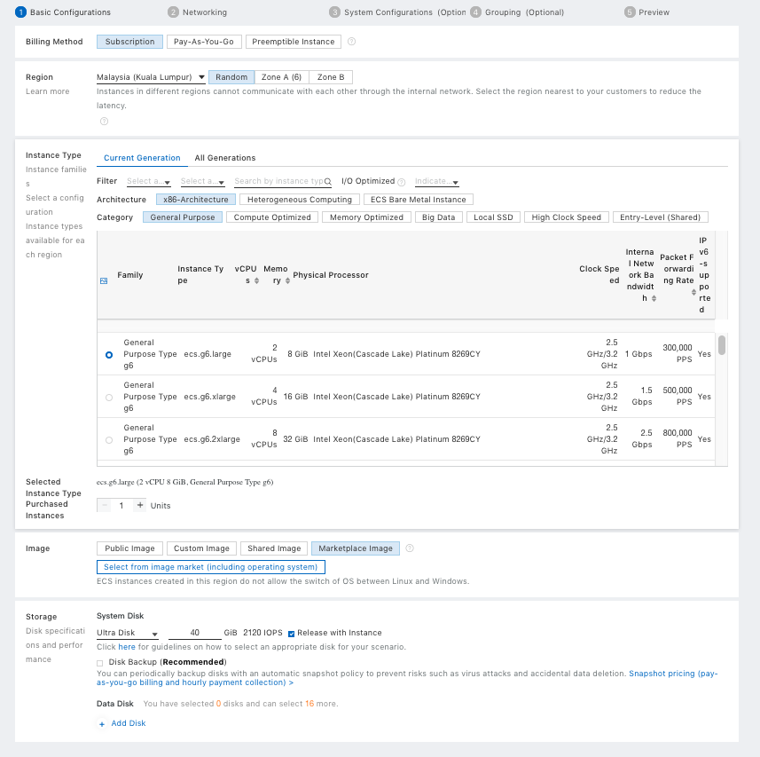

# Overview
This getting started guide will explain how to launch a NetFoundry application gateway in the Alibaba Cloud.

## Launching an instance in Alibaba Cloud

### Pre Deployment

{!common/byol-important.md!}

### Deployment of Appliance

To get started, go to **Elastic Compute Service**, click on **Create Instance**.
The following screen will appear.

<ul>
<li>Choose the Billing Method fit your need </li>
<li>Choose the region and zone you want your VM to deploy in </li>
<li>Choose the instance type. We recomment at least 2 vCPUs + 4GiB Memory </li>
<li>Choose number of Instances you want </li>
<li>Find the Marketplace Image for <strong>NetFoundry Application Gateway</strong></li>
<li>Choose the size of Disk. The default size is okay.</li>
</ul>
click on **Next: Networking** to open the next screen

Make your required selection then proceed to the next page (System Configurations).

<ul>
<li>Select your key pair. <strong>You must use key pair to login</strong></li>
<li>Change the Instance Name to your desired name</li>
<li>Optionally enter a host name</li>
</ul>

Continue to the next page to make more optional changes or hit "Preview" to the final page before creating the VM.

### Post Deployment

Go to the virtual machine you created, and locate the public IP address of the virtual machine.

Using an SSH client, log in to the machine using its public IP address as the user "nfadmin", using the SSH key or password specified earlier.

    > ssh -i [path/to/private/key] nfadmin@[public_ip_address]

Once you are logged in to the gateway, follow the instructions to register it to your NetFoundry Network. Look for errors in the registration process output, or "Success" if registration completes successfully. **\[registration key\]** is the key you captured earlier. [How to Register a NetFoundry Cloud Gateway VW](https://support.netfoundry.io/hc/en-us/articles/360034337892)

It may take up to 5 minutes to register and come online. Once the Gateway Instance has started up, switch back to the NetFoundry Console and locate the Gateway Endpoint.

Confirm that the status indicator is green, which means that it has successfully registered and is online. If the status indicator remains grey, then the gateway has failed to register. If it is red, the gateway has registered, but is offline.

Setup is complete.

