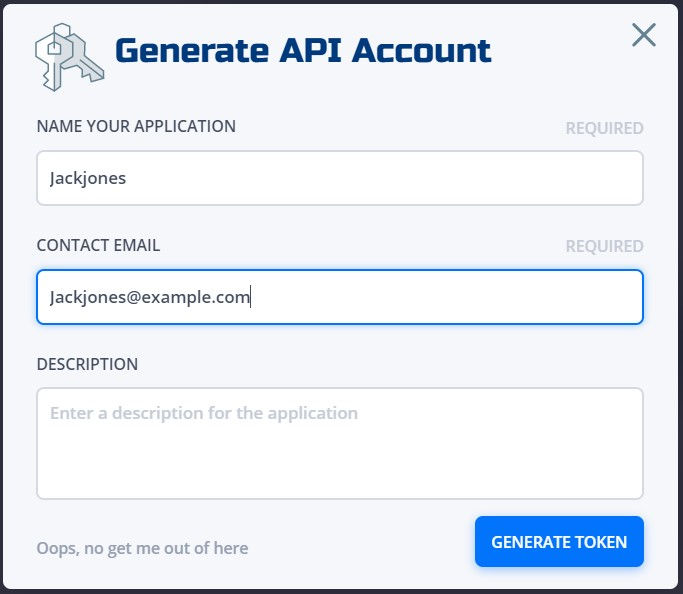

# Welcome to the API Section

In order to gain access to the NetFoundry system via API you need to create a ClientId and ClientSecret using the console.

Here is how to get clientId and secret from NFconsole.

login to nfconsole ->organization->Manage API account-> click '+' sign to create one.

provide the required details and click on generate token.

Copy the clientID and secret and save it securely.

.

Please visit the [NetFoundry Developer Portal](https://developer.netfoundry.io/) to learn more about the NetFoundry API.