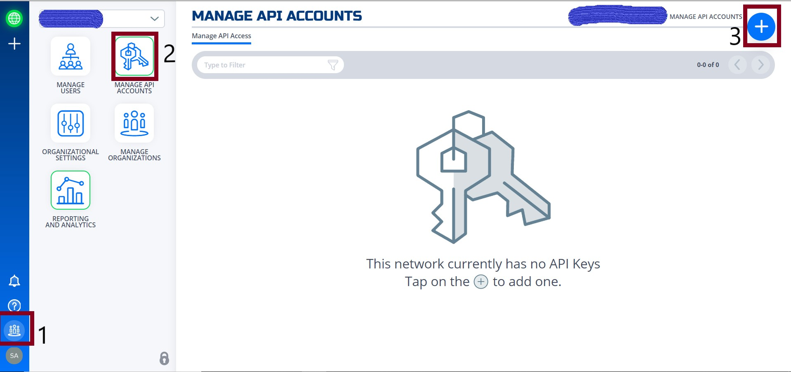

This section provides the powershell code to spin up a NF client with the name as computer name fetched by PS script. 

1.Here are the parameters used in the script few needs to be changed to suit your need for eg. network_name and region_ name.

``` yaml
clientId /secret: from NF console steps below.
environment: Production 
network_name: e.g. DemoNet01 
audience: URI for the Auth0 
api_endpoint: URI for the API calls
region_name: The region_name is the reference region or location where client will be created 
            (reference closest AWS location) e.g.us-east-1
provider: AWS 
```
Here is how to get clientId and secret from NFconsole. 

login to nfconsole ->organization->Manage API account-> click '+' sign to create one.



provide the required details and click on generate token.


Copy the clientID and secret and save it securely.

.


2.To create a unique client we can use second half of computer name below powershell cmdlet will fetch the same.

```powershell
#Set Endpoint name to second half of computer name:
$endpoint_name = $ENV:COMPUTERNAME.Split("-")[-1]
```
3. This section creates an access token by an api call using parameters defined earlier. 

```powershell
# Get a auth token from Auth0
$auth_payload = @{
    client_id=$client_id
    client_secret=$client_secret
    audience=$audience
    grant_type='client_credentials'
}

$auth_json = $auth_payload | ConvertTo-Json

$post_uri =  "https://netfoundry-" + $environment + ".auth0.com/oauth/token"

$auth0_response = Invoke-RestMethod -Method Post -Uri $post_uri -ContentType 'application/json' -Body $auth_json

$token = $auth0_response.access_token

#Inserting auth token to headers for API calls 
$headers = New-Object "System.Collections.Generic.Dictionary[[String],[String]]"
$headers.add("Authorization", ("Bearer " + $token))
```
4. This is how to get datacenterId and networkId which basically makes an API call to strips off unwanted information. 
This information will be used to create client later.

```powershell
# Get a dataCenter ID:

$datacenter_uri = $api_endpoint + "/dataCenters"

$dataCenter_response = Invoke-RestMethod -Method Get -Uri $datacenter_uri -ContentType 'application/json' -Headers $headers

$dataCenter = $dataCenter_response._embedded.dataCenters | where { $_.locationCode -like $region_name -and $_.provider -like $provider }  | select _links

$dataCenterId = ($dataCenter._links.self.href).Split("/")[-1]
```

```powershell
# Get a Network ID:

$network_uri = $api_endpoint + "/networks"

$network_response = Invoke-RestMethod -Method Get -Uri $network_uri -ContentType 'application/json' -Headers $headers

$network = $network_response._embedded.networks | where { $_.name -like $network_name } | select _links

$networkrId = ($network._links.self.href).Split("/")[-1]
```
6. Below section of the script uses computername, networkId and datacenterId from above sections to make API call create a NF client and fetch the regitration key.

```powershell
# Create an Endpoint & get reg key

$endpoint_uri = $api_endpoint + "/networks/" + $networkrId + "/endpoints"

$endpoint_payload  = @{
    name = $endpoint_name
    endpointType = "CL"
    dataCenterId = $dataCenterId
}

$endpoint_json = $endpoint_payload | ConvertTo-Json

$endpoint_response  = Invoke-RestMethod -Method Post -Uri $endpoint_uri -ContentType 'application/json' -Body $endpoint_json -Headers $headers

$endpoint_registration_key = $endpoint_response.registrationKey
```
7. This section will run a registration script silently to register the NF client.

```powershell
# Run registration script
Start-Process -FilePath C:\Program Files\DVN\vtc_app\nfnreg $endpoint_registration_key
```

Here is full script [PS script](../source-code/NF-pwrshell.ps1)