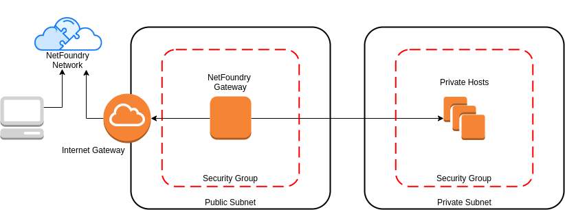
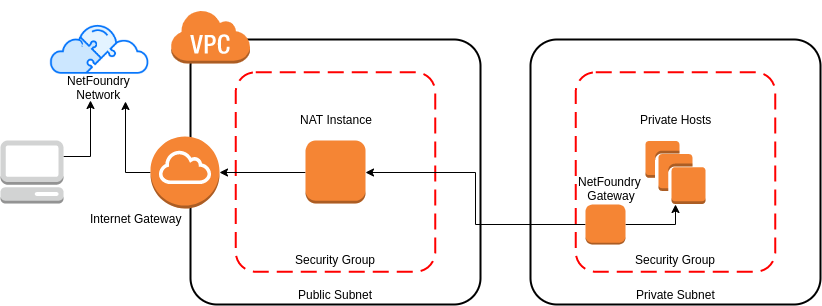

# Overview

**What is a Bastion Host?**

`A bastion host is a server whose purpose is to provide access to a private network from an external network, such as the Internet. Because of its exposure to potential attack, it's important to lock this down as tightly as possible.`

**How can NetFoundry Help?**

`Deploying a bastion host setup with NetFoundry is more secure!  Why?  Because the bastion doesn't need to be directly accessible from outside networks. It only needs outbound access & can reside in either public or private networks.`

# Solution Architecture

## Standard Bastion Setup

## Netfoundry

### Public

### Private

{!common/fabric-client-important.md!}

# Implement Through NF Web Console UI

{!common/install-nf-client.md!}

{!common/create-aws-gateway.md!}

{!common/create-ip-network-service.md!}

{!common/create-appwan-client.md!}
