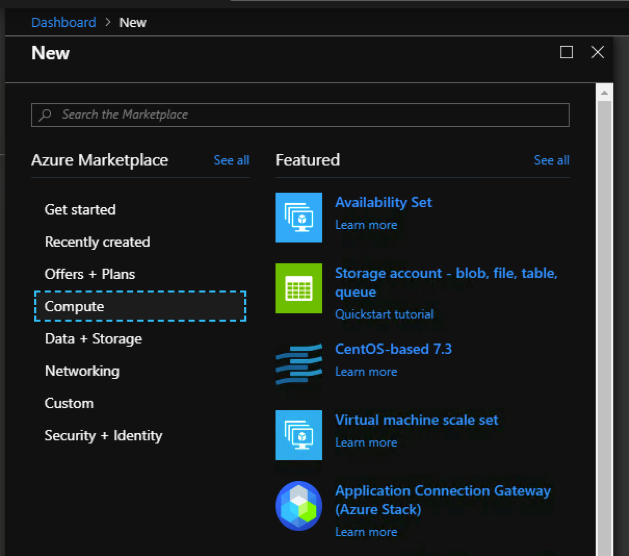

# 1 Administrator setup

Before the Netfoundry’s “Application Connection Gateway” can be consumed by the user, the administrator must download the image from Azure marketplace to the stack marketplace.

There is comprehensive guide from azure stack documentation on how to make image available for the local consumption.  The document can be found here:

[Download Azure marketplace](https://docs.microsoft.com/en-us/azure-stack/operator/azure-stack-download-azure-marketplace-item?view=azs-1908)

Please locate the offering “Application Connection Gateway” and make it available via download to the azure stack.

Once the download is complete, the image can now be used by the local user.

# 2 Setup a VCPE Gateway on the Azure stack

{!common/create-azurestack-gateway.md!}

## 2.2 Launch a NetFoundry Gateway Instance Inside of Your Azure Stack
* Sign in to your account on the Azure portal and go to → Resource groups. 
* Once inside the resource group, Click the "+ Add" button on the toolbar.
* Search for " Application Connection Gateway (Azure Stack)". Click on the result, the description should be shown.

* Click the "Create" button to launch the wizard.
* Enter basics information:
* Enter the Username as "nfadmin". 

!!! important
    The username must be **nfadmin** to gain access to this gateway; (_the username restriction will be removed soon_)

* Click OK to continue
* Next page, on choosing the compute size, it varies depends on your need. We are using a 2 VCPUs and 4 GB RAM for this example.

* Continue to finish setup and let system bring up the VM.

## 2.3 Register the gateway with your NetFoundry Network
Once the resource is created, go to the resource group & click on the virtual machine name to view the details. Locate the machine's public IP address.

Using an SSH client, log in to the machine using its public IP address as the user "nfadmin", using the SSH key or password specified earlier.

    > ssh -i [path/to/private/key] nfadmin@[public_ip_address]

---
***What to do if you cannot login to the VM?***

`It has been discovered that when using some version of Azure Stack (i.e. 1.1908.0.20) that after launching the VM, the user must reset the SSH key via the Azure console.`

`This is accomplished by selecting the newly created VM and clicking "reset password" in the bottom left hand corner of the console.`

`Here, you will find two fields to fill in; the first being the username (nfadmin), followed by the ssh key field where the user will enter the contents of their public ssh key.`

`Once the fields are populated properly, select "update".`

---

Once you are logged in to the gateway, run these commands to register it to your NetFoundry Network. Look for errors in the registration process output, or "Success" if registration completes successfully. **\[registration key\]** is the key you captured earlier.

    > sudo nfnreg [registration key]
    > sudo systemctl status dvn.service

 
The output should report **ACTIVE**.

Most common causes for registration to fail are: Not having an IP assigned (correctly), Not having a working default gateway for Internet access, Not having a valid DNS resolver.

It may take up to 5 minutes to register and come online. Once the Gateway Instance has started up, switch back to the NetFoundry Console and locate the Gateway Endpoint.

Confirm that the status indicator is green, which means that it has successfully registered and is online. If the status indicator remains grey, then the gateway has failed to register. If it is red, the gateway has registered, but is offline.

# 3 Create Service to Reach the server
Here is an example on how to reach the server on the Azure stack side by using the AppWan provisioning on the NetFoundry Console.

In this example, we are going to assume the client you are using to connect to the server is called **NFCLIENT1**.

On the NFCONSOLE, choose **MANAGE APPWANS** button.

On the MANAGE APPWANS screen, hit the **+** button.

Choose **CREATE APPWAN**, a form will display for you to create the AppWAN.

    1 Fill in the Application Name (Examples can be: Access US WEST STACK, Access Webpage)
    2 Choose your GW
    3 Fill in the Connection information.  This is where you want the traffic to go once it reaches the Azure Stack GW (in our example, we fill in a subnet: 192.168.2.0/24)
    4 Add your client to the APPWAN

Hit **Create your APPWAN**, and your AppWAN will be created.

Once the AppWAN is created, your client **NFCLIENT1** should be able to access the network “192.168.2.0/24” via the Azure Stack GW.
