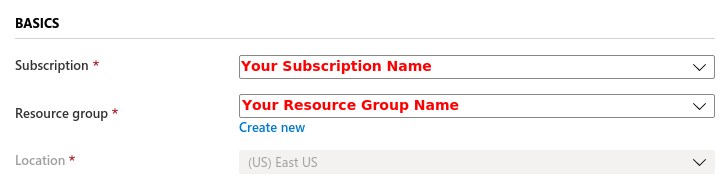
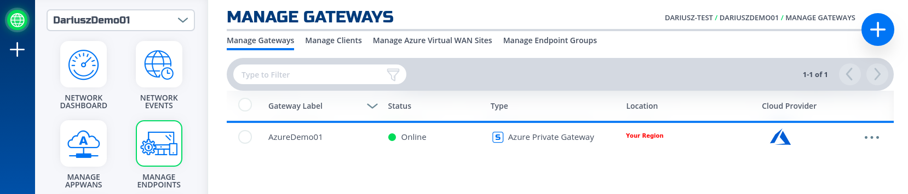
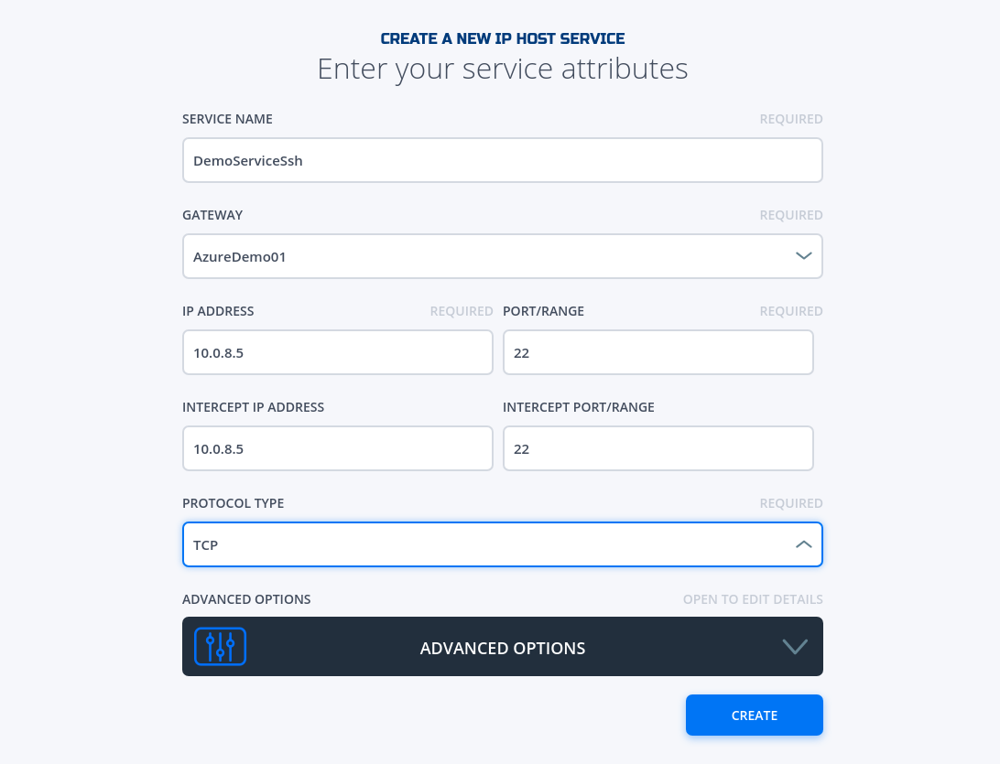
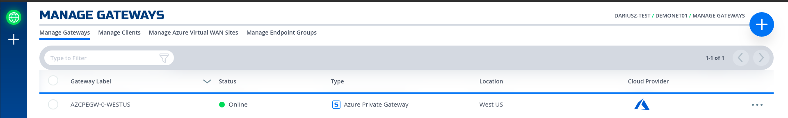
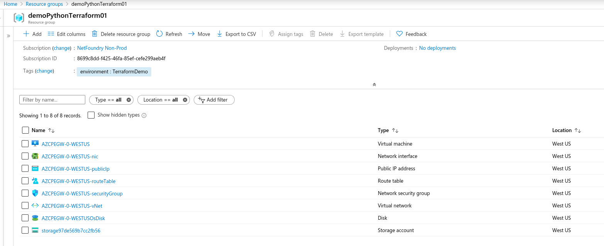
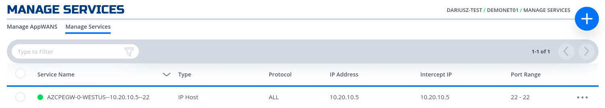
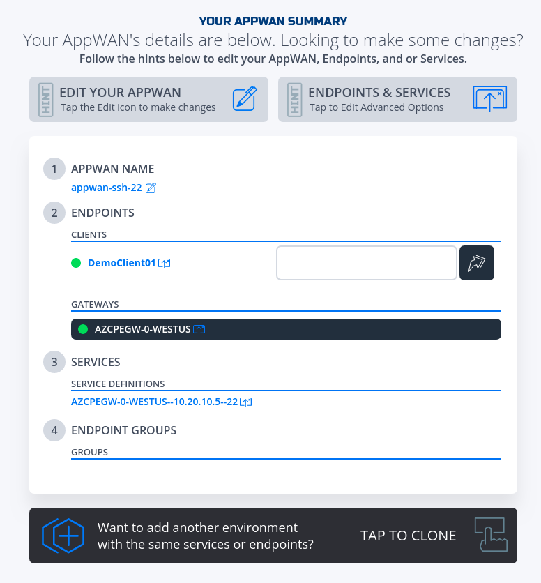

# User to Cloud Application Connection
This quickstart guide will provide all the steps to create a secure service between a user and an application hosted in Azure Cloud using NetFoundry Overlay Fabric (NFOF).

!!! important
    Assumption is that the [NF Fabric](../netfoundry/fabric.md) is already up and the [NF Client](../netfoundry/client.md) is installed.

## Through NF Web Console UI

{!common/nf-client-install.md!}

### Create and Install NF Azure Gateway
This section will guide a user through the steps on how to create a NF Manage Gateway in the NF Console UI and install it in the Azure vNet.

!!! example "Console UI"
    1. Navigate to Manage Gateways Page
    1. Click on + sign in the top right corner.
    
    1. Click on "Create Gateway" on the Azure Cloud Gateway Card
    
    1. Fill in the required information and click on "Create"
    
    1. Copy the Client Registration Key
    
    1. Click on "Deploy to Microsoft Azure". It will take you to the Azure Portal and ask you for your login credentials.
    1. You will be presented with the template that needs to be filled. The first section is the Basics regarding your Subscription and Resource Group this gateway will be deployed in.
    
    1. The second section related to resources associated with this gateway. e.g. vm name, ip address space, security groups, etc. you will paste the registration key copied in step 5. You will also need the public ssh key to use for access to this gateway remotely.
    
    1. You will need to agree to Azure Marketplace Terms and Conditions and click to "Purchase" to continue.
    
    1. If the NF Gateway was deployed successfully. Here is the view of the Resource Group and NF Conole UI.
    
    
    1. Done

### Create Service
This section will guide a user through the steps on how to create a NF Service.

!!! example "Console UI"
    1. Navigate to Manage Services Page under Manage Appwans
    1. Click on + sign in the top right corner.
    
    1. Click on "Create an IP Host Service"
    
    1. Fill in the required information for SSH and click on "Create"
    
    1. If successfully, the service is green.
    
    1. Done

### Create AppWan
This section will guide a user through the steps on how to enable service connectivity to users by creating an appwan.

!!! example "Console UI"
    1. Navigate to Manage AppWANS Page under Manage Appwans
    1. Click on + sign in the top right corner.
    
    1. Click on "Component Builder Appwan"
    
    1. Moved the desired client (e.g. DemoClient01) from "Available" Clients to "Selected" Endpoints. Moved the desired service (e.g. DemoClient01) from "Available" to "Selected" Services.
    
    1. Click on "Create".
    
    1. Done

## Programmatically

### via REST API (Python)

!!! note
    For the code clarity, we have broken down the code into multiple Python modules  

    1. [NF REST CRUD (Create,Read, Update and Delete) operations](../../python/nf_requests.py)
    1. [Get MOP Session Token](../../python/nf_token.py)
    1. [Create NF Network](../../python/nf_network.py)
    1. [Create NF Gateway(s)](../../python/nf_gateway.py)
    1. [Create NF Service(s)](../../python/nf_service.py)
    1. [Create NF AppWan(s)](../../python/nf_appwan.py)
    1. [Wrapper Script to Create NF Resources based on Resource yaml file](../../python/nf_resources.py)

    To obtain a session token, the [MOP Session Token](../../python/nf_token.py) script parses a configuration file
    for clientId, and secretId if they are not passed to it through the positional arguments
    (env, clientId, secretId). It must be located in the home directory under ['~/.env'](../../python/env).

    Additionally, we created the Terraform module ([main.tf](../../terraform/m-azure/main.tf) and [variables.tf](../../terraform/m-azure/variables.tf)) for Azure to aid the deployment of gateway(s) into Azure vNet(s). We created the Terraform Python modules ([nf_tf_main_file.py](../../python/nf_tf_main_file.py) and [nf_tf_modules.py](../../python/nf_tf_modules.py)) that the python wrapper, script based on [Resource yaml](../../python/nf_resources.yml) file, calls them to create the Terraform plan main file  in the working directory, and then applies it using the Terraform module.

    Assumption, [the network named DemoNet01](../netfoundry/fabric.md) has already been created. If not network action would need to be "create" not "get". The "get" action just means that the network ID will be search based on the name provided and use to add gateways to.

    The new Resource Group in Azure will be created named "demoPythonTerraform01" if one does not exists already in the same region (e.g. centralus). A new vnet will be created and NF Gateway will be placed in it.

    Environment means the NF Console Environment used, not  Azure.

!!! example "via REST API (Python)"
    1. Clone this repo (git clone https://github.com/netfoundry/mop.git)
    1. Update [Resource yaml](../../python/nf_resources.yml) file with the desired options to feed into the wrapper script as described
    in the following code snippet.
    [All Resource.yml Options](./README.md)
    1. Run this from the root folder to create GW in NF Console UI and Azure.
    ``` python
    python3 quickstarts/docs/python/nf_resources.py --file quickstarts/docs/python/nf_resources.yml
    ```
    Required Configuration Parameters for Gateway Creation
    ``` yaml
    environment: production
    network_action: get
    network_name: DemoNet01
    gateway_list:
    - action: create
      cloud: azure
      count: 1
      names: []
      region: westus
      regionalCidr: [10.20.10.0/24]
      regkeys: []
      resourceGroup:
        name: demoPythonTerraform01
        region: centralus
      tag: TerraformDemo
    terraform:
      bin: terraform
      output: 'no'
      source: ./quickstarts/docs/terraform
      work_dir: .
    ```
    1. After the script is run successfully, one can see that the gateway name and registration key were saved Resource.yml file. The nam eis created automatically based on region and gateway type (AZCPEGW means an azure type gateway in NF console).
    ``` yaml
    environment: production
    gateway_list:
    - action: create
      cloud: azure
      count: 1
      names:
      - AZCPEGW-0-WESTUS
      region: westus
      regionalCidr:
      - 10.20.10.0/24
      regkeys:
      - 21DB86724EC3F31C11C1C9D68CE5ECD6A06F057E
      resourceGroup:
        name: demoPythonTerraform01
        region: centralus
      tag: TerraformDemo
    network_action: get
    network_name: DemoNet01
    terraform:
      bin: terraform
      output: 'no'
      source: ./quickstarts/docs/terraform
      work_dir: .
    ```
    
    
    1. Create a test server vm on the same vNet if not already present.
    
    1. Update the Resoure.yaml file to include the Service option to create the NF service on the gateway create in the previous step. make sure to change the action on the gateway to "get".
    ``` yaml
    environment: production
    gateway_list:
    - action: get
      cloud: azure
      count: 1
      names:
      - AZCPEGW-0-WESTUS
      region: westus
      regionalCidr:
      - 10.20.10.0/24
      regkeys:
      - 21DB86724EC3F31C11C1C9D68CE5ECD6A06F057E
      resourceGroup:
        name: demoPythonTerraform01
        region: centralus
      tag: TerraformDemo
    network_action: get
    network_name: DemoNet01
    terraform:
      bin: terraform
      output: 'no'
      source: ./quickstarts/docs/terraform
      work_dir: .
      services:
      - action: create
        gateway: AZCPEGW-0-WESTUS
        ip: 10.20.10.5
        port: 22
        name:
        type: host
    ```
    1. After the script ran again successfully, the service section should have been populated with the service name as so.
    ``` yaml
    services:
    - action: create
      gateway: AZCPEGW-0-WESTUS
      ip: 10.20.10.5
      name: AZCPEGW-0-WESTUS--10.20.10.5--22
      port: 22
      type: host
    ```
    
    1. Create a client endpoint if not already done so.
    
    1. Update the Resoure.yaml file to include the AppWan option to create the NF AppWan tying the gateway, clinet and service created in the previous steps. Make sure to change the action on the service to "get".
    ``` yaml
    environment: production
    gateway_list:
    - action: get
      cloud: azure
      count: 1
      names:
      - AZCPEGW-0-WESTUS
      region: westus
      regionalCidr:
      - 10.20.10.0/24
      regkeys:
      - 21DB86724EC3F31C11C1C9D68CE5ECD6A06F057E
      resourceGroup:
        name: demoPythonTerraform01
        region: centralus
      tag: TerraformDemo
    network_action: get
    network_name: DemoNet01
    services:
    - action: get
      gateway: AZCPEGW-0-WESTUS
      ip: 10.20.10.5
      name: AZCPEGW-0-WESTUS--10.20.10.5--22
      port: 22
      type: host
    terraform:
      bin: terraform
      output: 'no'
      source: ./quickstarts/docs/terraform
      work_dir: .
    appwans:
    - action: create
      endpoints:
      - AZCPEGW-0-WESTUS
      - DemoClient01
      name: appwan-ssh-22
      services:
      - AZCPEGW-0-WESTUS--10.20.10.5
    ```
    1. After the script ran again successfully, the connectivity should have been up.
    
    1. To test connectivity, log in to the DemoClinet01 and run ssh "username"@"privateIp"
    
    1. To delete resources created, just follow the reverse order. First AppWans
    ``` yaml
    appwans:
    - action: delete
      endpoints:
      - AZCPEGW-0-WESTUS
      - DemoClient01
      name: null
      services:
      - AZCPEGW-0-WESTUS--10.20.10.5--22
    ```
    1. Then services
    ``` yaml
    services:
    - action: delete
      gateway: AZCPEGW-0-WESTUS
      ip: 10.20.10.5
      name: null
      port: 22
      type: host
    ```
    1. Endpoints - will delete all resources in Azure as well.
    ``` yaml
    gateway_list:
    - action: delete
      cloud: azure
      count: 1
      names: []
      region: westus
      regionalCidr:
      - 10.20.10.0/24
      regkeys: []
      resourceGroup:
        name: demoPythonTerraform01
        region: centralus
      tag: TerraformDemo
    ```
    1. Network
    ``` yaml
    environment:  production
    network_action: delete
    network_name: DemoNet01
    ```
