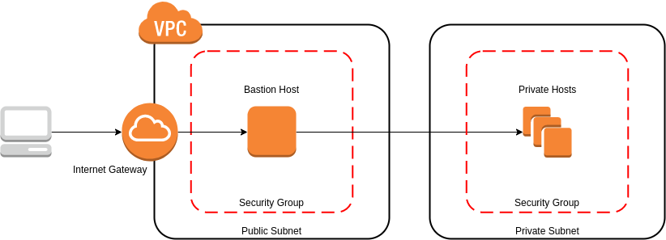

# Overview

**What is a Bastion Host?**

`A bastion host is a server whose purpose is to provide access to a private network from an external network, such as the Internet. Because of its exposure to potential attack, it's important to lock this down ast tightly as possile.`

**How can NetFoundry Help?**

`Deploying a bastion host setup with NetFoundry is more secure!  Why?  Because the bastion doesn't need to be directly accessible from outside of the public or private networks.  It only needs outbound access.` 

# Solution Architecture

## Standard AWS Bastion

## Netfoundry

### Public

### Private

