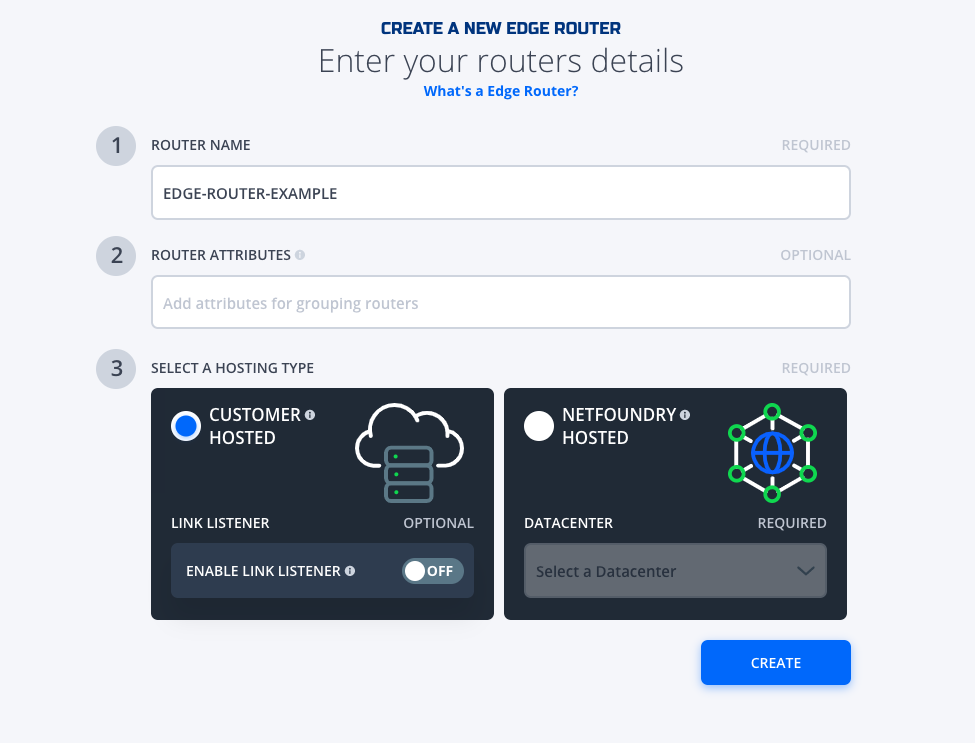
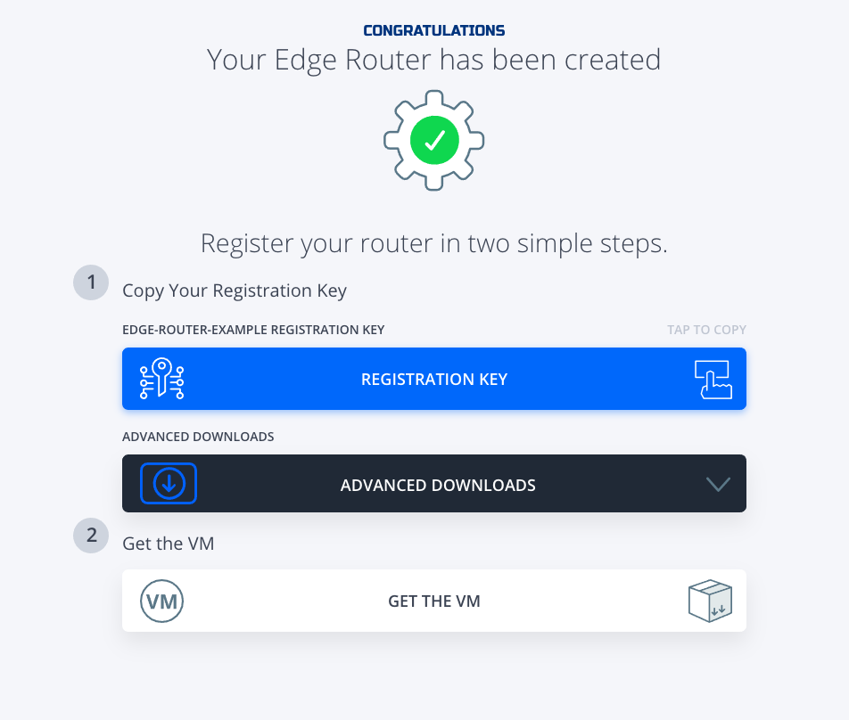
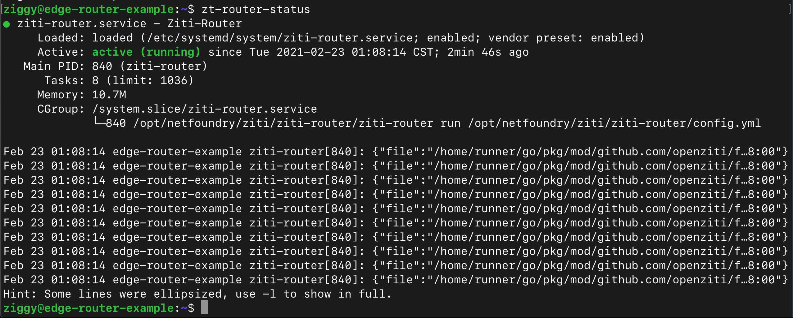

# 1 Create a Edge Router VM on the Alicloud ECS

Create a VM with the **Netfoundry Edge Router** offering from the Alicloud Marketplace

**You must use sshkey pair to create the VM**

# 2 Setup the Edge Router

## 2.1 Create a Edge Router in the NetFoundry Console

* Sign in to your NetFoundry organization at (https://nfconsole.io). If you don't have an account yet, you can sign up for free trial.
* Navigate to the "Edge Routers" page and create a new edge router. Give it a name, clink on "Customer Hosted", then click the Create button.

* Take note of the registration key. You will need it to register the gateway later.

 

## 2.2 Register the Edge Router with your NetFoundry Network
Go to the virtual machine you created, and locate the public IP address of the virtual machine.

Using an SSH client, log in to the machine using its public IP address as the user "ziggy", using the SSH key or password specified earlier.

    > ssh -i [path/to/private/key] ziggy@[public_ip_address]

Once you are logged in to the gateway, run these commands to register it to your NetFoundry Network. Look for errors in the registration process output, or "Successfully registered" if registration completes successfully. **\[registration key\]** is the key you captured earlier.

    > sudo router-registration [registration key]
    > zt-router-status

 
The output should report **ACTIVE**.

It may take up to few minutes to register and come online. Once the Edge Router Instance has started up, switch back to the NetFoundry Console and locate the Edge Router.

Confirm that the status indicator is green, which means that it has successfully registered and is online. 

