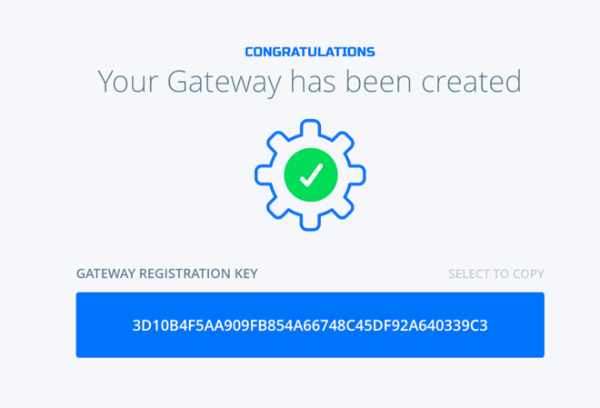
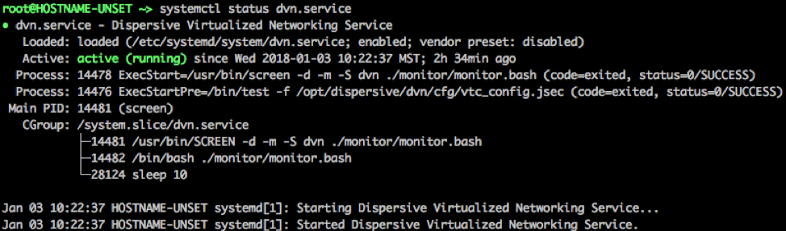
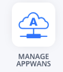

# 1 Create a Gateway VM on the Alicloud ECS

Create a VM with the **Netfoundry Application Gateway** offering from the Alicloud Marketplace

**You must use sshkey pair to create the VM**

# 2 Setup the Gateway

## 2.1 Create a Gateway in the NetFoundry Console

* Sign in to your NetFoundry organization at (https://nfconsole.io). If you don't have an account yet, you can sign up for free trial.
* Navigate to the Gateways page and create a new gateway. Give it a name and location, then click the Create button;
* Take note of the registration key. You will need it to register the gateway later.

 

## 2.2 Register the gateway with your NetFoundry Network
Go to the virtual machine you created, and locate the public IP address of the virtual machine.

Using an SSH client, log in to the machine using its public IP address as the user "nfadmin", using the SSH key or password specified earlier.

    > ssh -i [path/to/private/key] nfadmin@[public_ip_address]

Once you are logged in to the gateway, run these commands to register it to your NetFoundry Network. Look for errors in the registration process output, or "Success" if registration completes successfully. **\[registration key\]** is the key you captured earlier.

    > sudo nfnreg [registration key]
    > sudo systemctl status dvn.service

 
The output should report **ACTIVE**.

It may take up to 5 minutes to register and come online. Once the Gateway Instance has started up, switch back to the NetFoundry Console and locate the Gateway Endpoint.

Confirm that the status indicator is green, which means that it has successfully registered and is online. If the status indicator remains grey, then the gateway has failed to register. If it is red, the gateway has registered, but is offline.

# 3 An Example Service provided by our product
Here is an example on how to reach the server on the Alibaba Cloud by using the AppWan provisioning on the NetFoundry Console.

In this example, we are going to assume the client you are using to connect to the server is called **NFCLIENT1**.

On the NFCONSOLE, choose **MANAGE APPWANS** button.

On the MANAGE APPWANS screen, hit the **+** button.

Choose **SIMPLE CLOUD APPWAN**, a form will display for you to create the AppWAN.

    1 Fill in the Application Name (Examples can be: Access AliCloud GW1, Access Webpage)
    2 Choose your Gateway
    3 Fill in the Connection information.  This is where you want the traffic to go once it reaches your gateway (in our example, we fill in a subnet: 192.168.2.0/24)
    4 Add your client to the APPWAN

Hit **Create your APPWAN**, and your AppWAN will be created.

Once the AppWAN is created, your client **NFCLIENT1** should be able to access the network “192.168.2.0/24” via the Gateway you just created.
