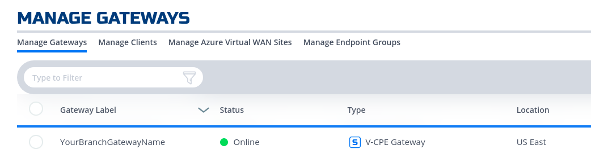
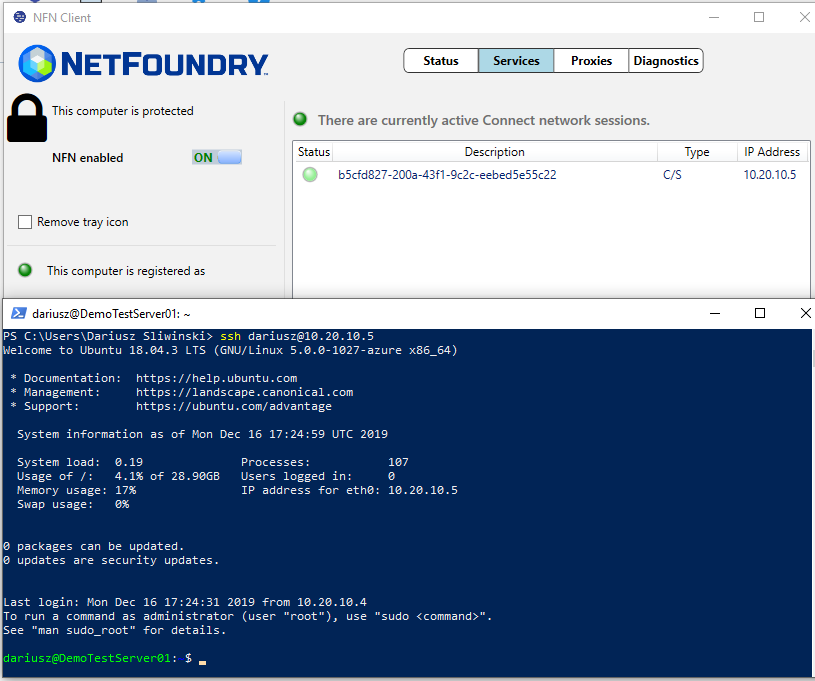

# Overview
This quickstart guide will provide all the steps to create a secure service between a branch application and/or user and an application hosted in Azure Cloud using NetFoundry Overlay Fabric (NFOF).

{!common/fabric-only-important.md!}

## Through NF Web Console UI

{!common/create-private-gateway.md!}

{!common/create-azure-gateway.md!}

{!common/create-ip-host-service.md!}

{!common/create-appwan-gateway.md!}

### Test Connectivity to Application Server

!!! note "Route to vNet"
    The private IP of NF Gateway (e.g. YourBranchGatewayName) needs to be the next hop to reach the vNet in Azure (e.g. 10.0.8.0/24).
    Thus, a static route will need to be configured in one of the branch routers. NF Gateway can support dynamic routing if needed (e.g.bgp, ospf)

!!! example "Steps"
    1. Log in to a Client App Host in Branch DataCenter
    1. Run ssh username@privateIpOfServerAppHostInAzure
    

## Programmatically

### via Python and Terraform

{!common/python-module-note.md!}

{!common/azure-environment-setup-note.md!}

!!! example "Steps"
    1. {!common/python-create-gateway.md!}
    1. Create a test server vm on the same vNet if not already present.
    
    1. {!common/python-create-service.md!}
    1. Create a gateway in the branch as the steps in [the UI section indicated](#create_and_deploy_nf_gateway_in_branch_datacenter).
    We will provide code snippets for private hypervisors deployment through python in later releases (e.g. vSphere)
    
    1. {!common/python-create-appwan.md!}
    1. To test connectivity, log in to the Remote Client or Branch App Server and run ssh "username"@"privateIp"
    
    1. {!common/python-delete-all.md!}

### via Jenkins

In this section, we will use [Resource yaml](../api/python/etc/nf_resources.yml) along with Jenkinsfile to show how to automate the steps further by creating the Jenkins Job

{!common/install-jenkins.md!}

{!common/create-ip-host-service.md!}

{!common/create-appwan-gateway.md!}
