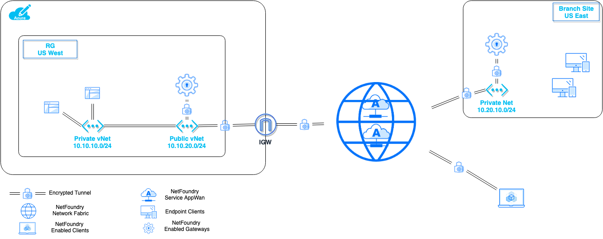

# Overview
Users or Applications can reach applications located in Azure's Private vNets over Internet using secure tunnels from anywhere users have connections to the Internet or Applications located in Private Branch Datacenters as depicted in the diagram.

!!! note
    The tunnels are encrypted and user-app or app-app sessions are hashed across 3 diverse paths by default.

## Use Case Diagram

