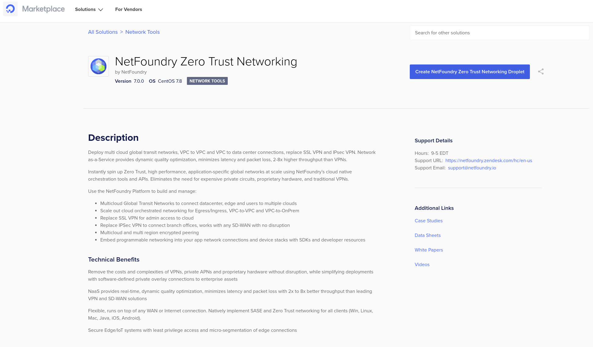

# Overview
This getting started guide will explain how to launch a NetFoundry Zero Trust Networking image into Digital Ocean.


## Launching an instance in Digital Ocean

### Pre Deployment

{!common/byol-important.md!}

{!common/fabric-only-important.md!}

### Deployment of Appliance

To get started, visit the Digital Ocean Marketplace site by clicking [here](https://marketplace.digitalocean.com/apps/netfoundry-zero-trust-networking). 
If the marketplace doesn't come up, you can go to the search bar that appears, enter NetFoundry Zero Trust Networking and click the resulting solution that appears.

To launch the instance **Click on "Create Netfoundry Zero Trust Networking Droplet"**


Supply the information needed


We recommend using only SSH Key to access, you can also choose password if needed.


Launch the droplet by **Clicking on "Create Droplet"**


### Post Deployment

!!! important
    The ssh username must be "root" & only if you specified an ssh key.  If you used password, you can only access via the Digital Ocean console.

```ssh -i [path/to/private/key] root@[public_ip_address]```

Once you are logged in to the gateway, follow the instructions to register it to your NetFoundry Network. Look for errors in the registration process output, or "Success" if registration completes successfully. [How to Register a NetFoundry Cloud Gateway VW](https://support.netfoundry.io/hc/en-us/articles/360034337892)

Setup is complete.
