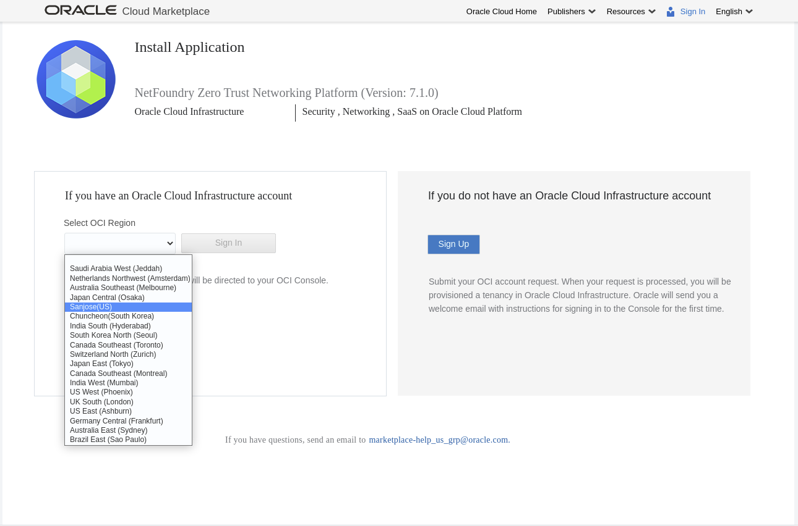
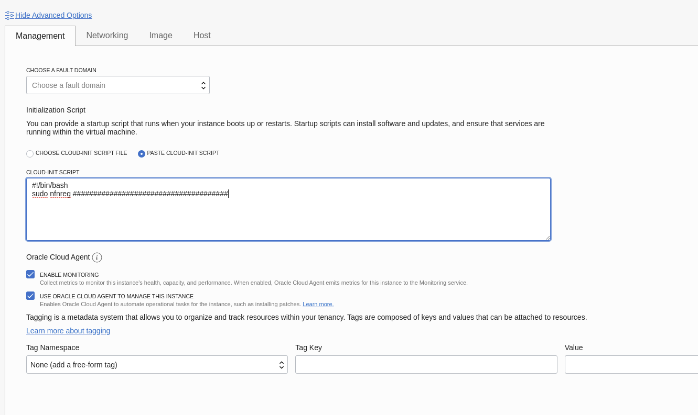

# Overview
This getting started guide will explain how to launch a NetFoundry application gateway in OCP(Oracle Cloud Platform) Compute


## Launching an instance in OCP

### Pre Deployment

{!common/byol-important.md!}

{!common/fabric-only-important.md!}

### Deployment of Appliance

To get started, visit the OCP Marketplace site by clicking [here](https://cloudmarketplace.oracle.com/marketplace/en_US/listing/82445301). 
If the marketplace doesn't come up, you can go to the search bar that appears, enter NetFoundry Application Gateway and click the resulting solution that appears.

To launch the instance **Click on "Get App"**


Select a **Region**, and **Click on "Sign In"**


Select the **Compartment** and check the **Oracle Terms of Use** the **Click on "Launch Instance"**


Select the Options:


Once the fields have been supplied, Click on **"Create"**

### Registration via Cloud-init

If you like to pass in the gateway registration key into the image launching.

**Click on "Show Advanced"** under the ssh keys assignments


Under the Cloud-Init **Select Paste Cloud-init Script**


Use the following code:
V3->V6:
```
#!/bin/bash
sudo nfnreg {Gateway Registration Key}
```
V7:
```
#!/bin/bash
sudo router-registration {Gateway Registration Key}
```

### Post Deployment

If you did not supply the **GatewayRegistrationKey** field during the deployment, you can access the machine via ssh, following the launch.  **Please Note** You must enable external IP in order to reach the launched machine remotely. 

Use the following command to register the gateway with your network:

V3->V6: 
```
sudo nfnreg {registration key}
```
V7: 
```
sudo router-registration {registration key}
```

Setup is complete.

