# CPE Automation For Ubuntu Image

Use this procedure to create NF Ziti-Router and / or Ziti-Tunnler enabled UCPE automatically.

# 1. Summary

## This guide will cover the following sections
<li>Create an automation VM by using OVA provided by NetFoundry. This is a one-time setup.
<li>Install Ubuntu 20.04 OS on the UCPE box.
<li>Run the automation script from the automation VM to setup the UCPE box

## This guide will not cover
<li> This guide will <b>only</b> cover deployment of OVA with VMWare6.7, it will not cover all hypervisors out there. However, the provided OVA will work with VM Workstation 12 or EXSi 6.5 or later and VirtualBox.
<li> This guide will not cover how to setup installation media of Ubuntu 20.04 OS. At the end of guide, it will describe where to find the OS image and some tools.

# 2. Create Automation VM

!!! NOTE
    This procedure only needs to execute once for all UCPE boxes. It is recommended to create this VM using VMWare hypervisor. 

## Obtain the CPE-Automation OVA

!!! Todo
    We will need to put the OVA somewhere customer can download.

## Create the VM with the OVA

From your hypervisor, create a VM and use the <b>Deploy from OVA</b> option


Hit "<b>Next</b>", and you can choose your OVA image and give a name to the VM you are creating


Hit "<b>Next</b>", it will ask you which storage (Disk) you want to put your VM.  Choose one that suits you.


Hit "<b>Next</b>“ and choose your Network. (Hint, "VM Network" is your default network, that usually is a good choice). For "Disk provisioning", you can leave it at the default choice of "Thin".


Hit "<b>Next</b>", and you are ready to deploy the OVA. Review the content carefully and hit "<b>Finish</b>" to deploy it.


After you hit "<b>Finish</b>", on the Task window, you should notice the VM been created. Once the it reaches 100%, your VM is created.  And it should automatically start after the deployment is done.


## Login and Check the automation VM

Once the VM is completely deployed, we need to make sure the VM is setup correctly.<br>
Go to the main VM window, right click on your VM,<br>
on the popup menu, choose "<b>Console</b>"->"<b>Open browser console</b>".


You will see a console window pop up like this:


Login to the console by using credential <br>
Username: <b>ziggy</b><br>
Password: <b>ziggy</b><br>
Check the IP setting by issuing "<b>ip a</b>" command. If you see a valid IP address, then your VM is on a network.


You can verify ssh access to the VM by using a ssh enabled terminal:

    > ssh nfadmin@[ip_address_of_the_automation_vm]

!!! Conclusion
    This is the end of deploying the automation VM.


# 3. Installing Ubuntu 20.04 Server on the CPE

!!! Note
     <b>Have this ready before you start:</b> You will need a "Ubuntu 20.04 Server" installation media before you start.
     

Insert an Ethernet Cable into your CPE and bootup your CPE via the installation media, you will encounter the first screen:

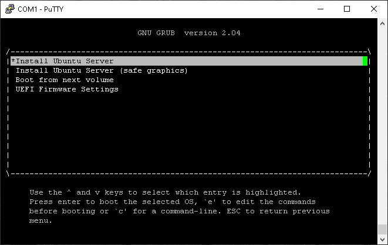
Choose "<b>Install Ubuntu Server </b>" to continue.<br>

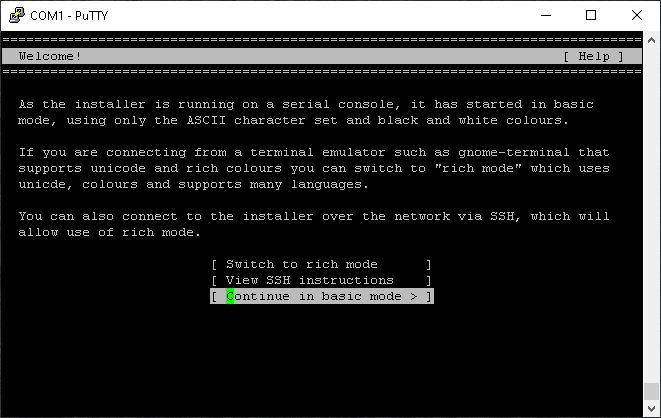
Some of the UCPE does not have a video / monitor connection, the installation has to be performed via the serial / console port.  The installation will ask if the user want so proceed with this setup.  Choose "<b>Continue in basic mode</b>" to continue.

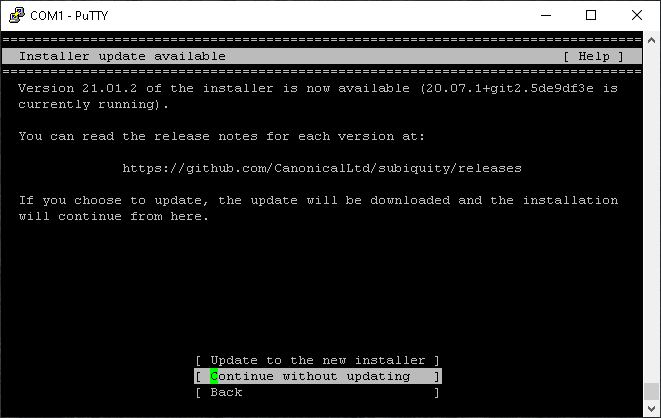
If the installation found a newer version of installer, it will ask user to update to new installer. We can simply choose "<b>Continue without updating</b>" to continue.

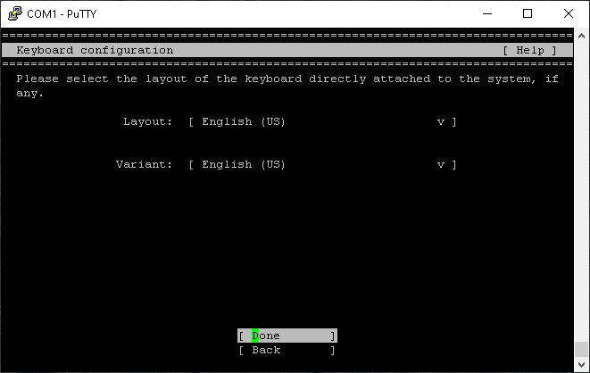
On the "Keyboard configuration" screen, Choose your Language. And hit "<b>Done</b>"

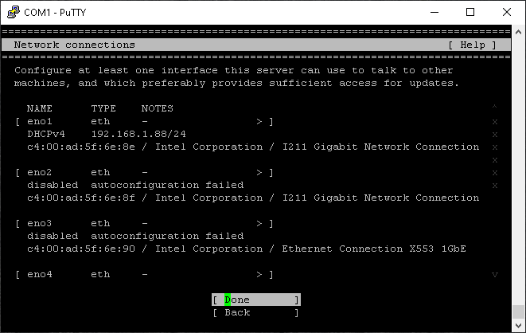
If you have Ethernet cable connected correct, the first interface will show the IP address. (We will need that IP address when we run the automation).  If you need to manually provision the IP, you may do so now.
Once you finish configuing the IP, you can hit "<b>Done</b>" to continue

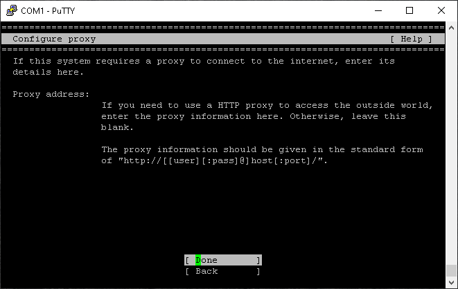
Configure proxy server, and then his "<b>Done</b>" to continue

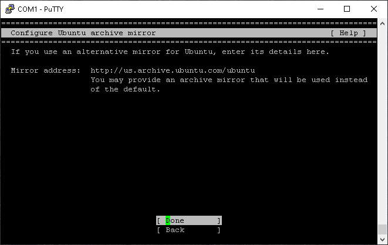
Configure Ubuntu archive mirror if you want to use different mirror site, and then hit "<b>Done</b>" to continue

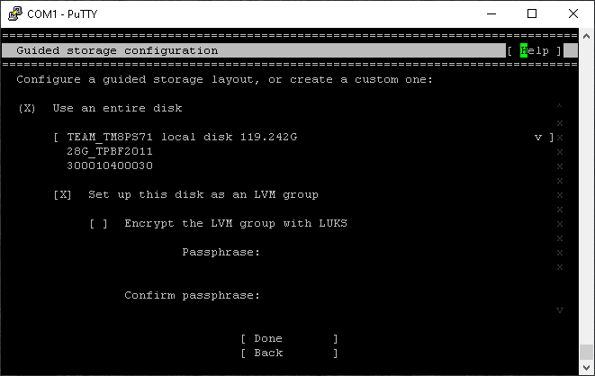
When configurating the disk, it is recommented to choose "<b>Use an entire disk</b>" and then hit "<b>Done</b>" to continue

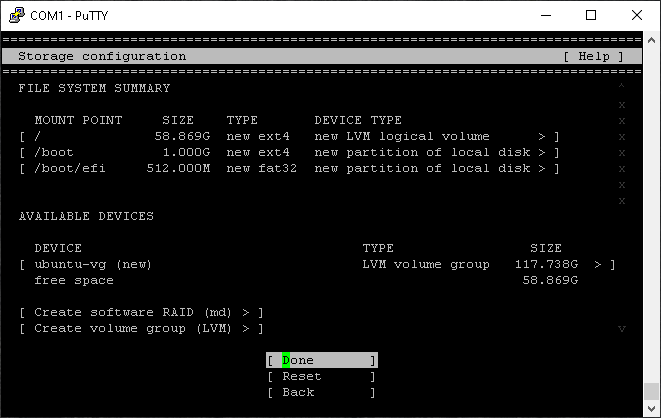
Then confirm your slection (default configuration is fine), then hit "<b>Done</b>" to continue

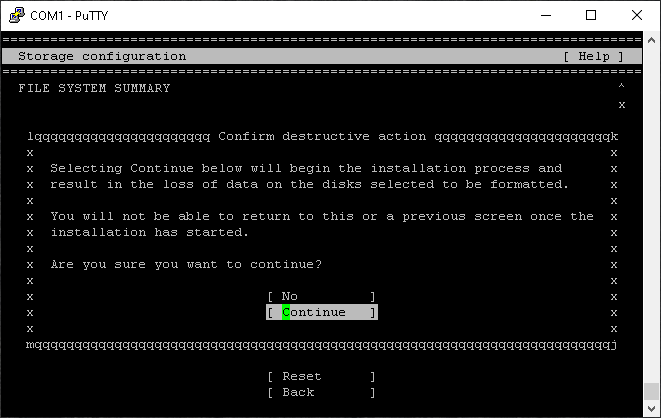
Confirm that your entire disk will be wiped, then hit "<b>Continue</b>"

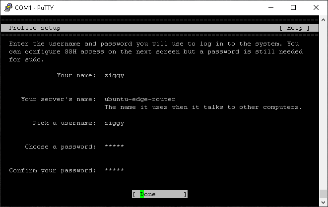
Setup the following parameter at "Profile setup"<br>
Pick a username: <b>ziggy</b><br>
Password: <b>ziggy</b><br>
Then click "<b>Done</b>" to continue

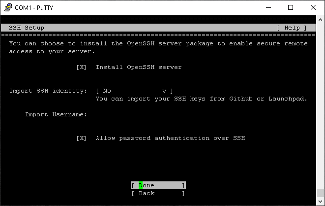
On the "SSH Setup" screen, make sure you choose "<b>Install OpenSSH server</b", and choose "<b> Allow password authentication over SSH</b>".

!!! Note
     You may use sshkey (instead of password) to run the ansible playbook. But that is beyond the scope of this document.

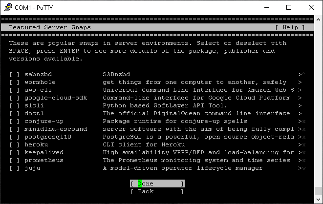
On the "Featured Server Snaps", you can skip the selection and scroll to the bottom and hit "<b>Done</b>" to continue

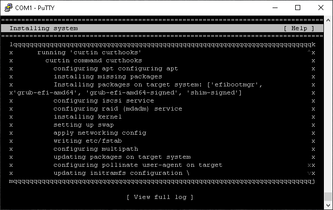
Now the installation will start, it will take few minutes for installation (and security update) to finish.

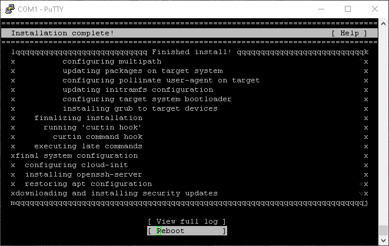
Once the installation finishes, the "<b>Reboot</b>" choice appear for you to restart the UCPE with the Ubuntu 20.04 server installed.

!!! Conclusion
    This is the end of installing Ubuntu 20.04 server on the UCPE box.


# 4. Run Automation to setup the UCPE box

!!! Note
     You will need the IP address of your automation VM and the IP address of your UCPE to continue this step

Connect to your automation VM via ssh from a terminal

    > ssh ziggy@[ip_address_of_the_automation_vm]

Login to the VM by using password: <b>ziggy</b>

Start the automation by issuing the following command:

    > ./setup-nfnbox.bash [ip_address_of_ucpe]

The automation will prompt you to enter<br>
"<b>SSH password</b>" to login to the UCPE box (<b>ziggy</b>)<br>
"<b>BECOME password</b>" (hit <ENTER\> key)
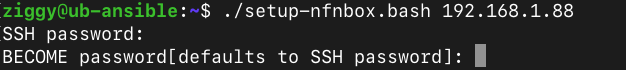

The automation will take a few minutes to complete. At the end of automation, you will see message like this:

```
PLAY RECAP *******************************************************************************************************************************
192.168.1.88               : ok=308  changed=28   unreachable=0    failed=0    skipped=160  rescued=0    ignored=0   

```

!!! Conclusion
    The UCPE is now setup and ready.


# Appendix A. Ubuntu 20.04 Server Installation Media

!!! Disclaimer
    There are many ways to obtain and setup the installation media. If you never set one up before, the quickest and easiest way to create one is by downloading the OS image and burn it to a USB by using disk utility.

## Ubuntu 20.04 Server image

You can obtain a copy of IOS by visiting <b>https://ubuntu.com/download/server</b> . Choose "<b>Option 2 - Manual server installation</b>".  Then Download the latest 20.04 LTS version. <br>

The downloaded server IOS should be a little over 1G <br>

## Burn Image to a USB stick

You can burn the image to a USB stick by using Rufus (if you are on a PC). You can find many tutorials on the internet if you have trouble
