# SuperMicro (UCPE) setup

Follow this guild to setup the SuperMicro box for use with V7 network. The OS for this white box will be Ubuntu 20.04

# 1. Introduction

We have not decided how to deliver our installation media to the customer yet.  That will be determined later on based on the system integrator we pick.

There are three approaches on how to deliver the image.
<li>Build a installation media with Cubic. Ship the installation media to the integrtor.
<li>Create an ansible image for the integrator.
<li>Create an golden image for the integrator.

#2. Cubic Approach

##2.1 General info

With the Cubic approach, the customer get a modified Ubuntu 20.04 installation image. This section is going to cover how to create that image. The image will not be CIS hardened.  The CIS hardening script renders the installation image useless.  The CIS hardening will need to be called via cloudinit after the installation, which makes the installation process much longer. So this approach is not desireable. 

##2.2 Obtain the installation media and create installation USB

The Cubic requires GUI to run, so the installation ISO can be the desktop version of the Ubuntu20.04.  But the installation ISO we going to create is based on the server version, so we going to cover the steps based on Ubuntu 20.04 server installation.

This document is not going to cover how to create USB installtion stick.

##2.3 Install Ubuntu 20.04 server on Supermicro

Before your installation starts, make sure you connect the ethernet cable to the first interface on the box.  This will make setup the interface a little easier.

Boot up the installation media and start the installation. 


<br>Choose the default "English" language or choose your desired language.


<br>Choose "Continue without updating".

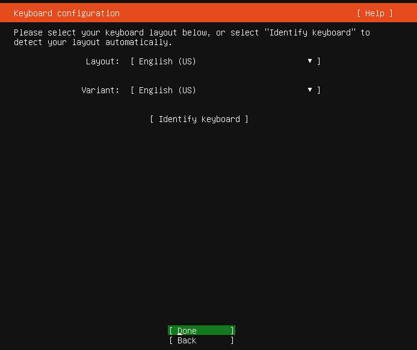
<br>Keep the default keyboard layout or choose your keyboard layout (for different language)

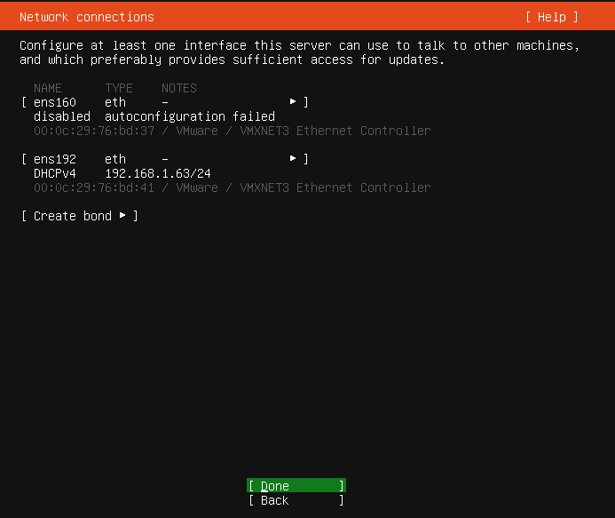
<br>On the Network interface page, if the interface is connected, you should see an IP address assigned automatically.  If you need to assign an manual IP, you can do so now.  Please write down the IP address, you will need that for the later steps.

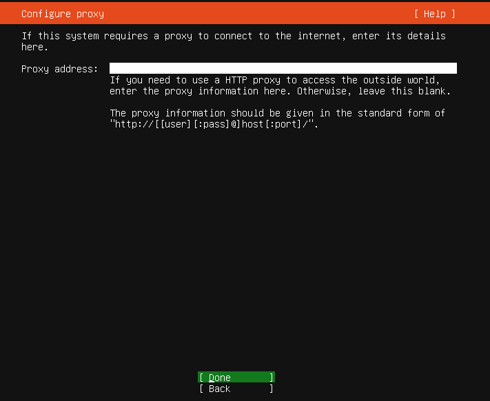
<br>Skip the Proxy address if you don't use proxy.


<br>Keep the default Mirror address and continue

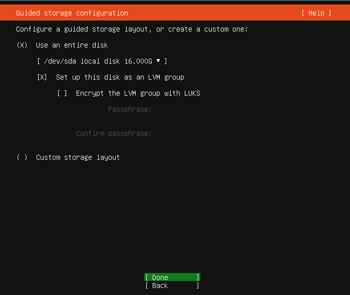
<br>Use the entire disk (the dafault) for installation.

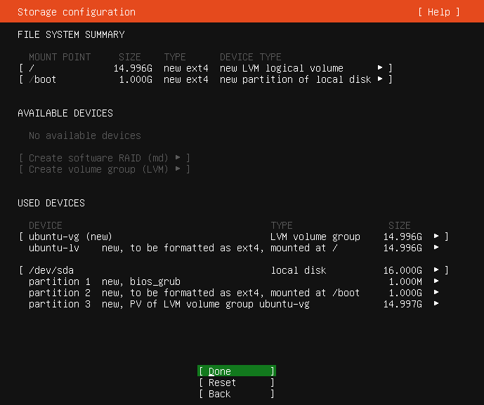


<br>Hit continue to confirm the selection


<br>Choose your username and server name. Write down the user name. We will need the user name to login to the system to do future configuration.


<br>Enable "Install OpenSSH server" for remote access to the server.

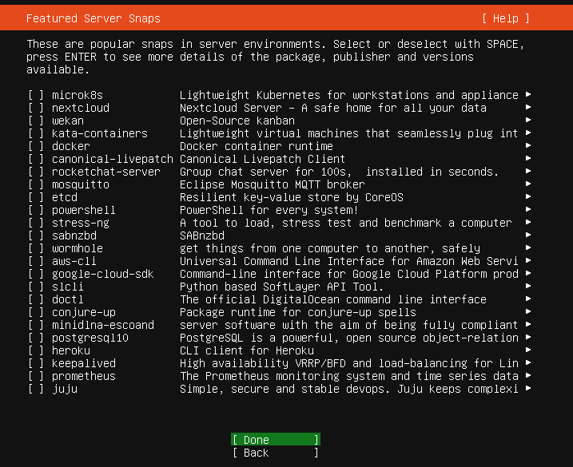
<br> Skip the snaps selection and continue.

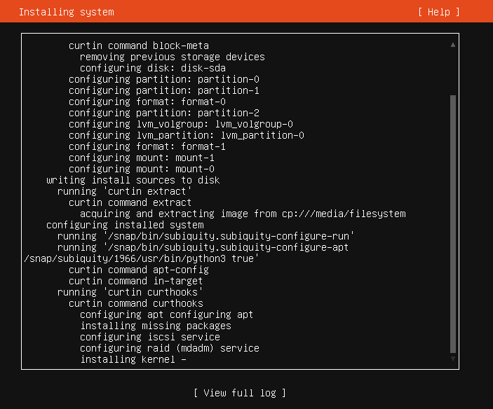
<br> Now system will go into installation and update of the security package. It will take few minutes to finish.


<br> When the installation completes, you can reboot the server.

##2.4 Install GUI
ssh into the box by using the IP address obtained above.  Install the GUI and cubic

```
ssh ziggy@192.168.1.63
ziggy@192.168.1.63's password: 
> sudo apt update
> sudo apt install tasksel
> sudo tasksel install ubuntu-desktop
> sudo apt-add-repository ppa:cubic-wizard/release
> sudo apt install cubic
```

Restart the box and login from the graphic terminal.
```
> sudo shutdown -r 0
```

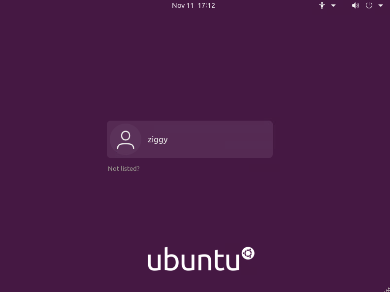


##2.5 Generate custom installer using Cubic

Copy Ubuntu 20.04 server image (ISO) into the box. If you have the image already, you can simply scp into the box.  Or you can download it again into your box by using firefox browser.

```
> scp ubuntu-20.04.1-live-server-amd64.iso ziggy@192.168.1.63:
ziggy@192.168.1.63's password: 
ubuntu-20.04.1-live-server-amd64.iso                                 100%  914MB  96.2MB/s   00:09    
```

Copy setup ansible playbook to the box.
```
> scp supermicro_playbook.tgz ziggy@192.168.1.63:
ziggy@192.168.1.63's password: 
supermicro_playbook.tgz                                              100%  147KB  24.4MB/s   00:00    
```

Start the Cubic on the desktop.


Create a directory (cubic1) to save the custom image


Choose the Ubuntu 20.04 server image. (Rest of the fields will fill themselves)


Once the image is decompress, you will see a "Custome Ubuntu ISO Creator" window.
Copy the supermicro ansible tarball into the that window.
then do the following commands:

```
> sudo apt install ansible
> tar xf supermicro_playbook.tgz 
> cd supermicro_playbook
> ansible-playbook -i hostfile ubbox.yml 
```

Once the ansible succesfully ran (if it is not successful, you can rerun it again), you can delete the playbook.

```
> cd
> rm -rf supermicro_playbook
> rm -rf supermicro_playbook.tgz
```

Hit Next on Cubic window and generate the installation image.


#3 Create Ansible playbook for integrator

Running ansible playbook vm is similar to the uCPE for v6.  


<li> This guide will <b>only</b> cover deployment of OVA with VMWare6.7, it will not cover all hypervisor out there. However, the provided OVA will work with VM Workstation 12 or EXSi 6.5 or later and VirtualBox.
<li> This guide will not cover how to setup installation media of Cent7 OS. At the end of guide, it will describe where to find the OS image and some tools.

# 2. Create Automation VM

!!! NOTE
    This procedure only needs to execute once for all CPE boxes. It is recommended to create this VM using VMWare hypervisor. 

## Obtain the CPE-Automation OVA

!!! Todo
    We will need to put the OVA somewhere customer can download.

## Create the VM with the OVA

From your hypervisor, create a VM and use the <b>Deploy from OVA</b> option
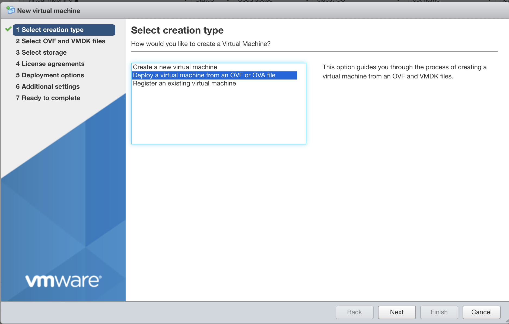

Hit "<b>Next</b>", and you can choose your OVA image and give a name to the VM you are creating


Hit "<b>Next</b>", it will ask you which storage (Disk) you want to put your VM.  Choose one that suits you.
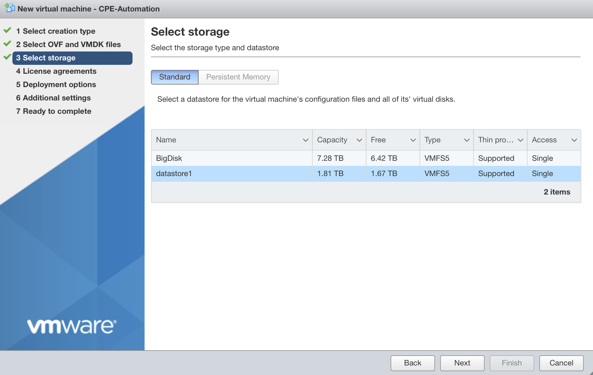

Hit "<b>Next</b>“ and choose your Network. (Hint, "VM Network" is your default network, that usually is a good choice). For "Disk provisioning", you can leave it at the default choice of "Thin".
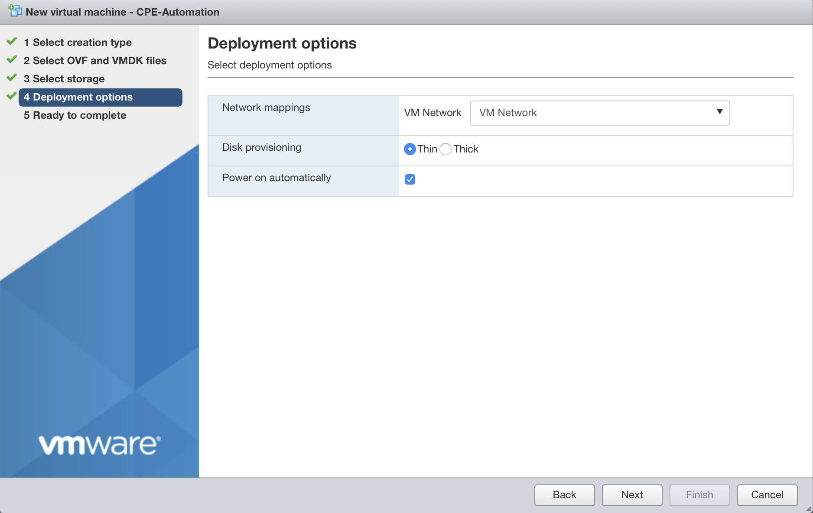

Hit "<b>Next</b>", and you are ready to deploy the OVA. Review the content carefully and hit "<b>Finish</b>" to deploy it.


After you hit "<b>Finish</b>", on the Task window, you should notice the VM been created. Once the it reaches 100%, your VM is created.  And it should automatically start after the deployment is done.
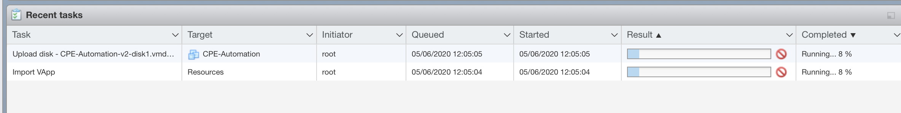

## Login and Check the automation VM

Once the VM is completely deployed, we need to make sure the VM is setup correctly.<br>
Go to the main VM window, right click on your VM,<br>
on the popup menu, choose "<b>Console</b>"->"<b>Open browser console</b>".


You will see a console window pop up like this:


Login to the console by using credential <br>
Username: <b>nfadmin</b><br>
Password: <b>nfadmin</b><br>
Check the IP setting by issuing "<b>ip a</b>" command. If you see a valid IP address, then your VM is on a network.
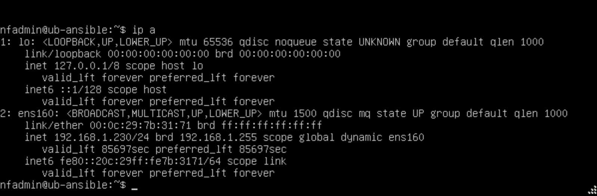

You can verify ssh access to the VM by using a ssh enabled terminal:

    > ssh nfadmin@[ip_address_of_the_automation_vm]

!!! Conclusion
    This is the end of deploying the automation VM.


# 3. Installing CentOS 7 on the CPE

!!! Note
     <b>Have this ready before you start:</b> You will need a CentOS 7 installation media before you start.
     

Insert an Ethernet Cable into your CPE and bootup your CPE via the installation media, you will encounter the first screen:
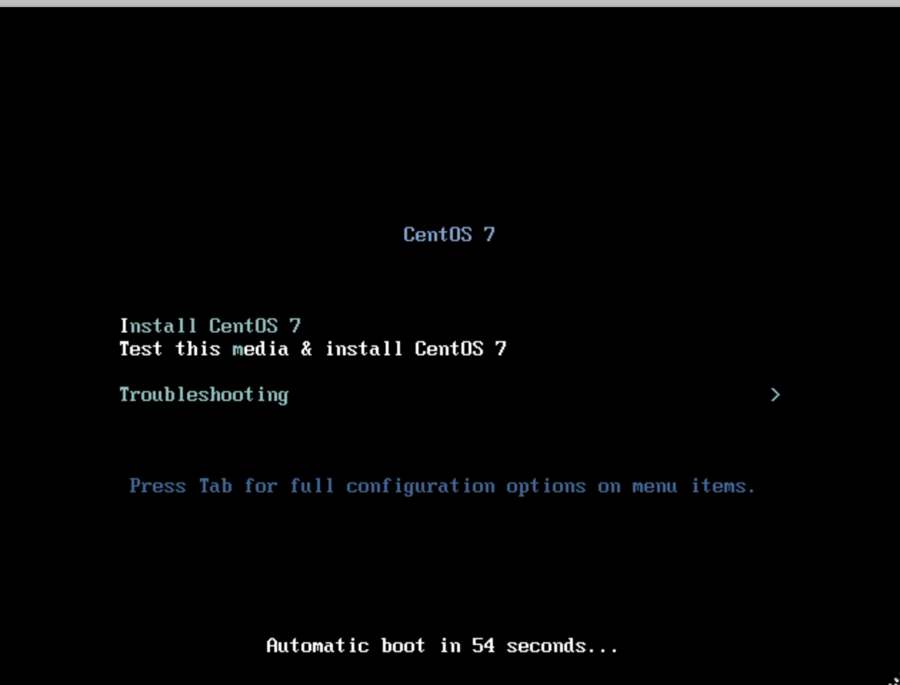

Choose "<b>Install CentOS 7</b>" to continue.<br>

On the next screen, Choose your Language. And hit "<b>Continue</b>"


The "<b>INSTALLATION SUMMARY</b>" screen will appear.<br>
Check to make sure the step (1) "<b>SOFTWARE SELECTION</b>" is set to "<b>Minimal Install</b>".<br>
Then Click on step (2) "<b>INSTALLATION DESTINATION</b>" to setup the Disk.
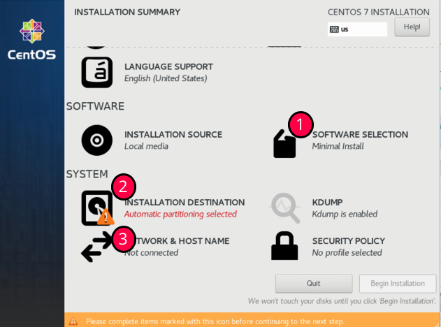

Once in the "<b>INSTALLATION DESTINATION</b>" screen<br>
Choose your Disk (NOT the USB installation media)<br>
Click on "<b>Automatically configure partitioning</b>"
Then hit "<b>Done</b>" at the top left screen to continue.  
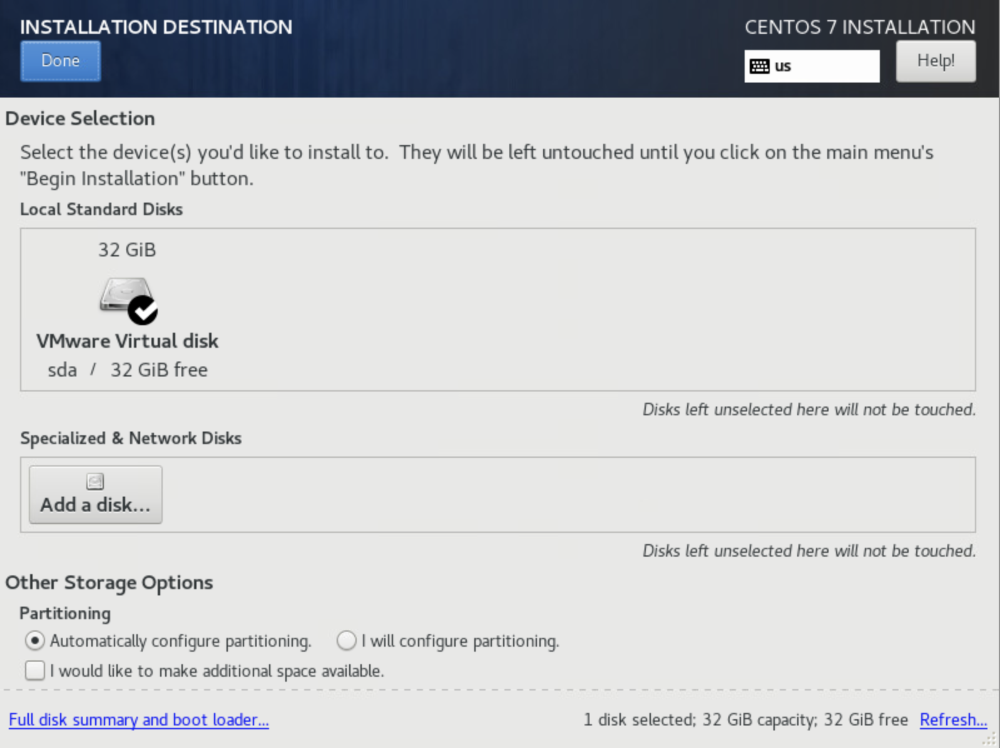

Once you are back to the "INSTALLATION SUMMARY" screen<br>
Choose step (3) "NETWORK & HOST NAME". The following screen should appear.<br>
Turn on the Ethernet by hitting the button marked (1).<br>
And then observe the IP Address appears below it (at area Marked (2)). (We will need that IP address when we run the automation).<br>
Then hit "<b>Done</b>" at the top left screen to continue.


You should be back to the "INSTALLATION SUMAMRY" screen again, and you can hit "<b>Begin Installation"</b>" to start the Installation.


During the installation, you need to create a user account. For our deployment, you do not need to create root Password. So, press on "<b>USER CREATION</b>" to create an Admin user.


On the "<b>CREATE USER</b>" screen, you need to fill the following:<br>
Username: <b>nfadmin</b><br>
click on "<b>Make this user administrator</b>"<br>
Password: <b>nfadmin</b><br>
You then need to click "<b>Done</b>" twice to exit this screen.  
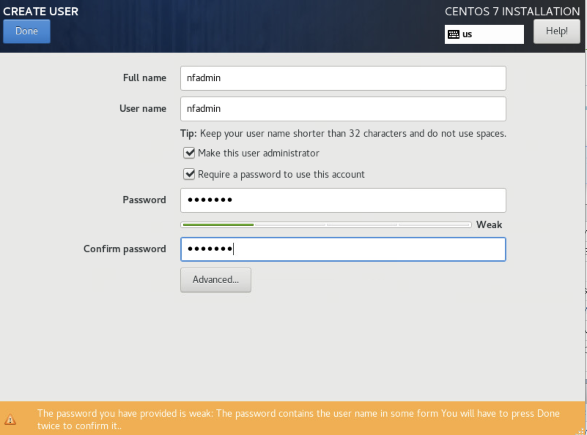

You will be sent back to the installation screen, wait for it to complete installation, and the "<b>Reboot</b>" button will appear for you to restart the CPE with the CentOS installed.
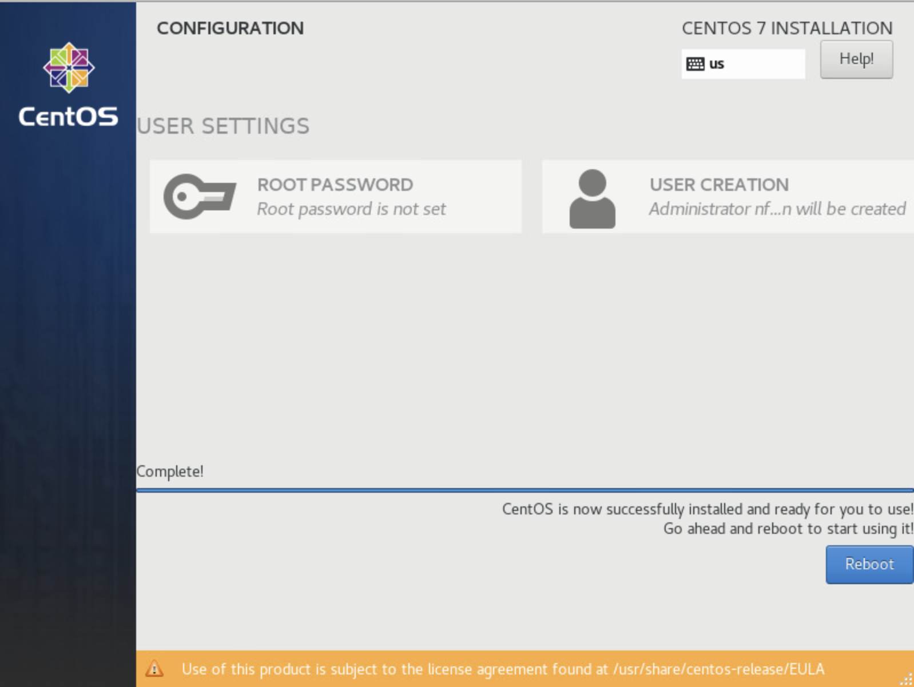

!!! Conclusion
    This is the end of installing CentOS 7 on the CPE box.


# 4. Run Automation to setup the CPE box

!!! Note
     You will need the IP address of your automation VM and the IP address of your CPE to continue this step

Connect to your automation VM via ssh from a terminal

    > ssh nfadmin@[ip_address_of_the_automation_vm]

Login to the VM by using password: <b>nfadmin</b>

Start the automation by issuing the following command:

    > ./setup-nfnbox.bash [ip_address_of_cpe]

The automation will prompt you to enter<br>
"<b>SSH password</b>" to login to the CPE box (<b>nfadmin</b>)<br>
"<b>BECOME password</b>" (hit <ENTER\> key)


The automation will take a few minutes to complete. At the end of automation, you will see message like this:

```
PLAY RECAP ******************************************************************************************************************
10.111.111.1               : ok=6    changed=3    unreachable=0    failed=0    skipped=0    rescued=0    ignored=0
192.168.1.184              : ok=35   changed=28   unreachable=0    failed=0    skipped=2    rescued=0    ignored=0
```

!!! Conclusion
    The CPE is now setup and ready.


# 5. CentOS 7 Installation Media

!!! Disclaimer
    There are many ways to obtain and setup the installation media. If you never set one up before, the quickest and easiest way to create one is by downloading the OS image and burn it to a USB by using disk utility.

## CentOS 7 image

You can obtain a copy of OS image by visiting centos.org. But since you need to get a CentOS 7 image (not the latest CentOS 8), here is a quick link to Cent7OS mirror sites: <br>

```
http://isoredirect.centos.org/centos/7/isos/x86_64/
```

Recommend download the "CentOS-7-x86_64-DVD-xxxx.iso" (around 4.5G). This is the image tested.  Since we use minimal installation from CentOS 7, so the minimal image should work also "CentOS-7-x86_64-Minimal-xxxx.iso" (around 1G)<br>

## Burn Image to a USB stick

You can burn the image to a USB stick by using Rufus (if you are on a PC). You can find many tutorials on the internet if you have trouble
