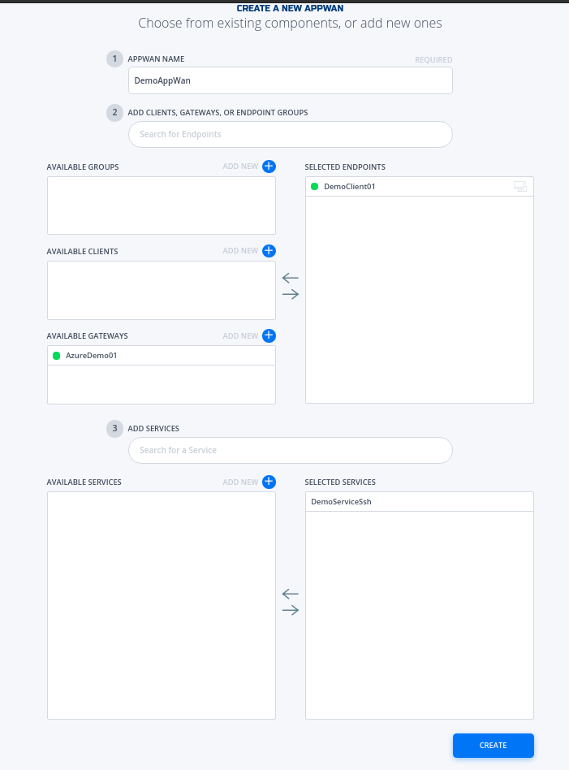

### Create AppWan
This section will guide a user through the steps on how to enable service connectivity to users by creating an appwan.

!!! example "Console UI"
    1. Navigate to Manage AppWANS Page under Manage Appwans
    1. Click on + sign in the top right corner.
    
    1. Click on "Component Builder Appwan"
    
    1. Moved the desired client (e.g. DemoClient01) from "Available" Clients to "Selected" Endpoints. Moved the desired service (e.g. DemoClient01) from "Available" to "Selected" Services.
    
    1. Click on "Create".
    
    1. Done