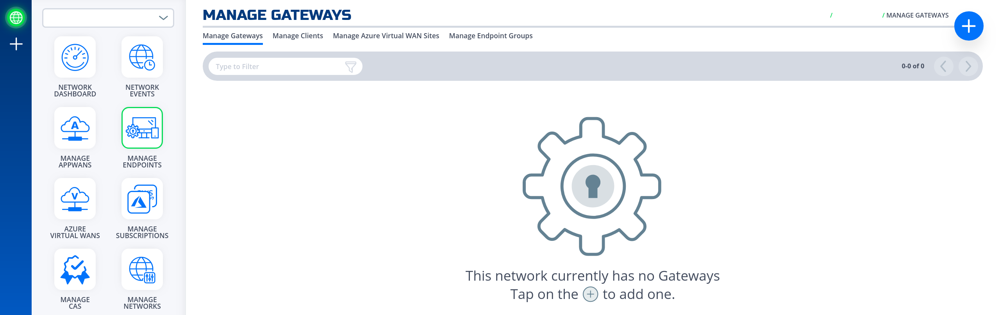
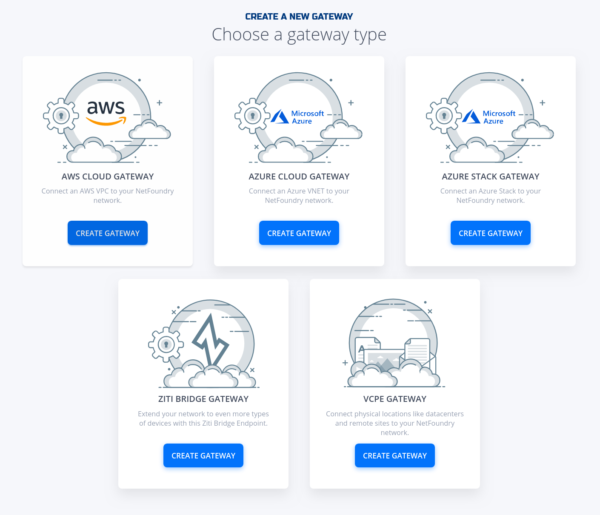
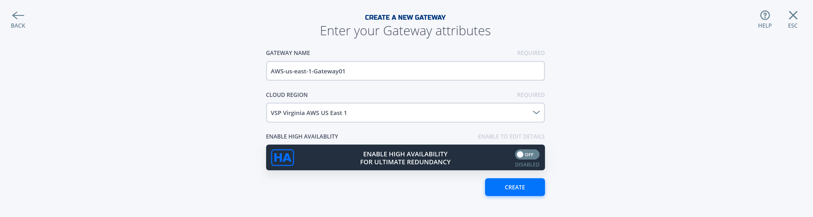
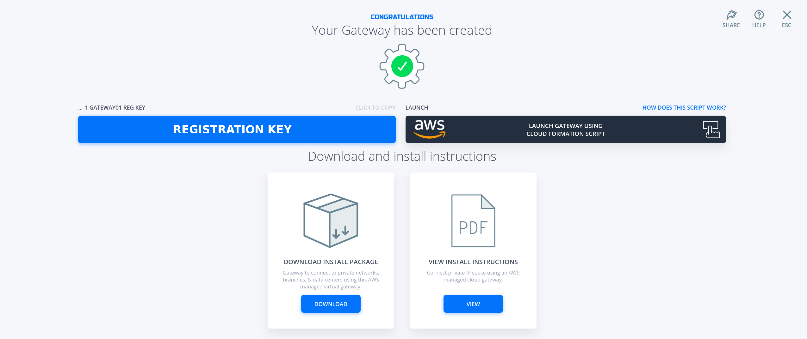
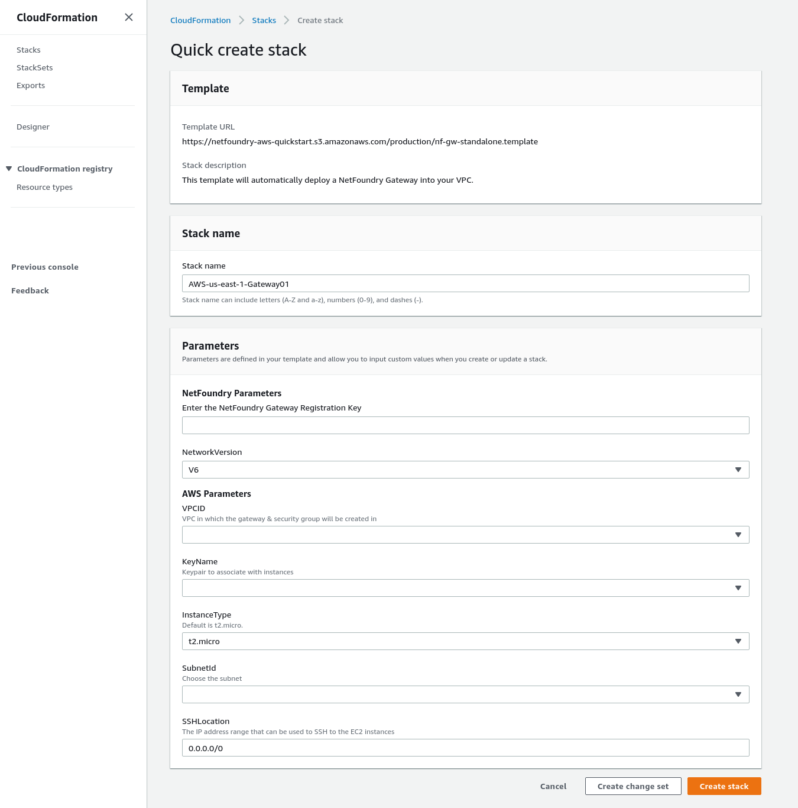
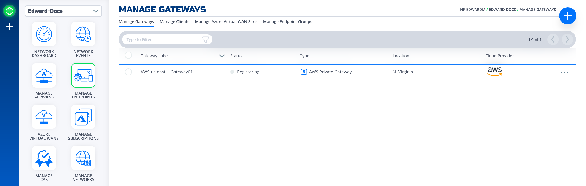

### Create and Install NF AWS Gateway
This section will guide a user through the steps on how to create a NF Manage Gateway in the NF Console UI and install it in an AWS VPC.

!!! example "Console UI"
    1. Navigate to Manage Gateways Page
    1. Click on + sign in the top right corner.
    
    1. Click on "Create Gateway" on the AWS Cloud Gateway Card
    
    1. Fill in the required information and click on "Create"
    

        !!! note
            If this is the first time you've ever launched an AWS NetFoundry Gateway
            You must accept the AWS license before launching the gateway, please click here: <a href="https://aws.amazon.com/marketplace/server/procurement?productId=ab038665-4673-4353-8349-31b860c3d5fc" target="_blank">AWS Marketplace</a>

    1. Click on "Launch Gateway Using CloudFormation Script". It will take you to the AWS console, if you're not already logged in it will ask you for your login credentials.
    
    1. You will be presented with the template parameters that needs to be filled. 
    
    1. Fill in the AWS Parameters Section with you're VPC & ssh keyname & Click Create Stack.
    1. If the NF Gateway was deployed successfully. Here is the view of the NF Conole UI.
    
    1. Done 