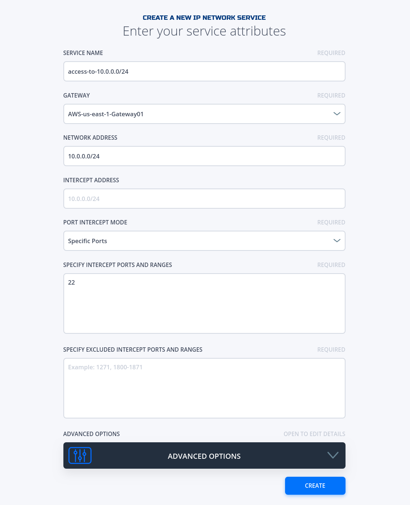
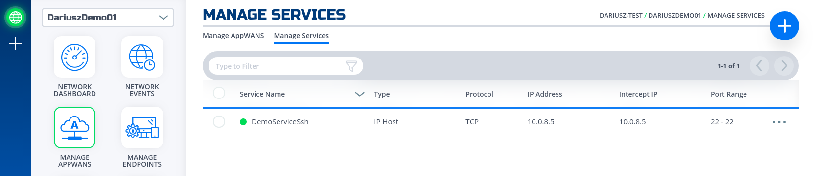

### Create IP Network Service
This section will guide a user through the steps on how to create a NF Service.

!!! example "Console UI"
    1. Navigate to Manage Services Page under Manage Appwans
    1. Click on + sign in the top right corner.
    
    1. Click on "Create an IP Network Service"
    
    1. Fill in the required information for the Network your wanting to access.
    

        !!! important
            Please make sure the service you want to access is behind the gateway you specify here.

    1. If successfully, the service is green.
    
    1. Done 