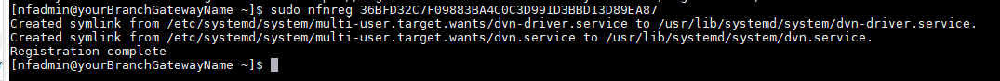

### Create and Deploy NF Gateway in Branch Datacenter
This section will guide a user through the steps on how to create a NF Manage Gateway in the NF Console UI and install it in the Branch Datacenter.

!!! example "Console UI"
    1. Navigate to Manage Gateways Page
    1. Click on + sign in the top right corner.
    
    1. Click on "Create Gateway" on the VCPE Gateway Card
    
    1. Fill in the required information and click on "Create"
    
    1. Copy the Client Registration Key
    
    1. Click on "Download" button on the Installation Package Card
    
    1. Download the correct image for the desired Hypervisor.
    1. Follow the installation procedure linked in the description of each image type (i.e. "Click Here").
    1. Once installed, login into it locally with ssh and register it using the key copied in the previous step. Run the following command `sudo nfnreg "reg key"`
    
    1. Once registered, one should see the gateway status turn to green in NF Console UI
    
    1. Done
