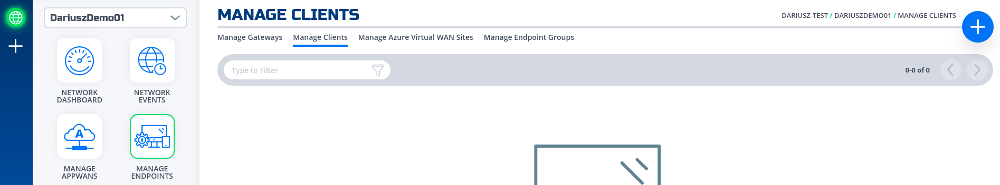
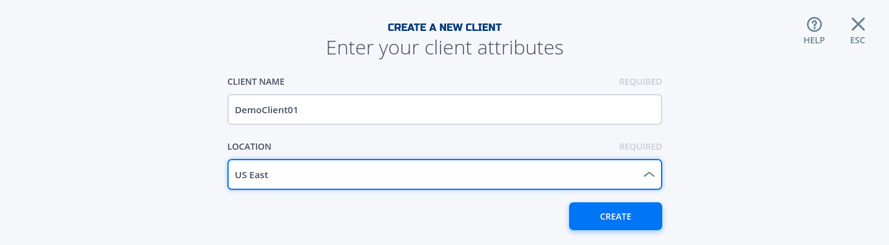

### Create and install NF Client
This section will guide a user through the steps on how to create a client in the NF Console UI. Then, it will provide links to Guides on how to install the NetFoundry Client Software for Windows and MAC Clients, including the registration with the  NF Network Fabric.

!!! example "Console UI"
    1. Navigate to Manage Clients Page
    
    1. Click on + sign in the top right corner.
    1. Fill in the required information and click on "Create"
    
    1. Copy the Client Registration Key
    
    1. Install the NF Client Software by following the directions at the appropriate OS link
        1. [Window](https://support.netfoundry.io/hc/en-us/articles/360017535332-Install-a-NetFoundry-Client-on-Windows)
        1. [Mac](https://support.netfoundry.io/hc/en-us/articles/360016128692-Install-a-NetFoundry-Client-on-MacOS)
