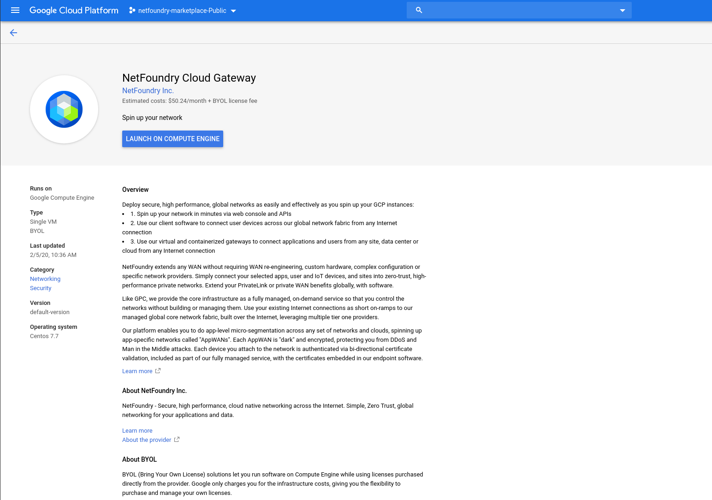
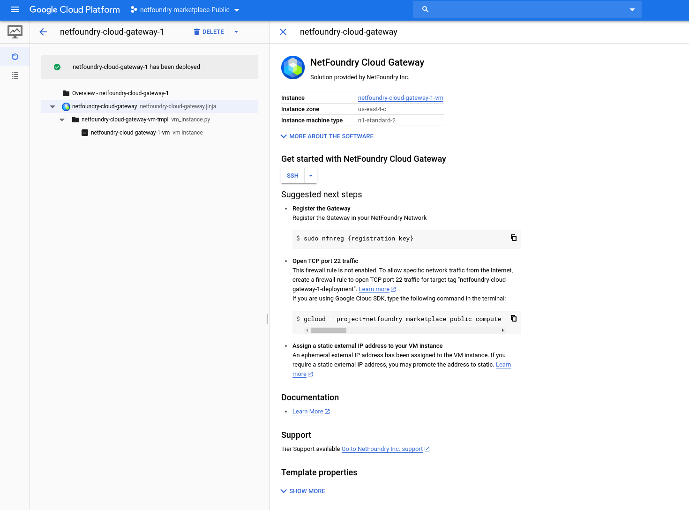

# Overview
This getting started guide will explain how to launch a netfoundry application gateway in the GCP compute engine.

## Lauching an instance in GCP

### Pre Deployment

{!common/fabric-client-important.md!}

### Deployment

1. Click on "Launch On Compute Engine"

1. Supply the information needed

1. GatewayRegistrationKey: This field allows you provide the gateway registation key that will passed into the lanching image. Automating the registration portion of the setup.  **This field is optional**, you can access the gateway via ssh & register after this deployment is complete.
1. Once the fields have been suplied, Click on "Deploy"

### Post Deployment

If you did not supply the registration key during the deployment, you can access the machine via ssh by Clicking on the "SSH" button:

Use the following command to register the gateway with your network:
>sudo nfnreg {registration key}

