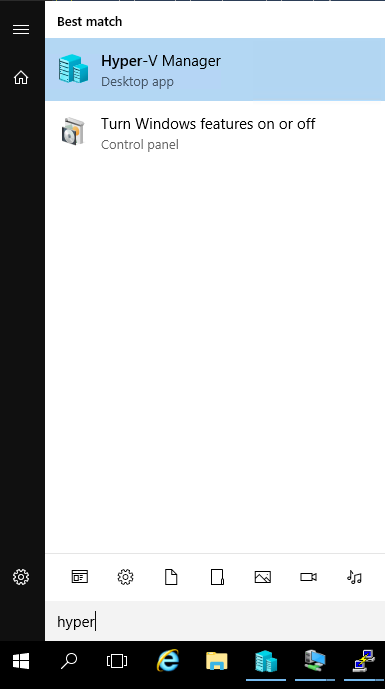
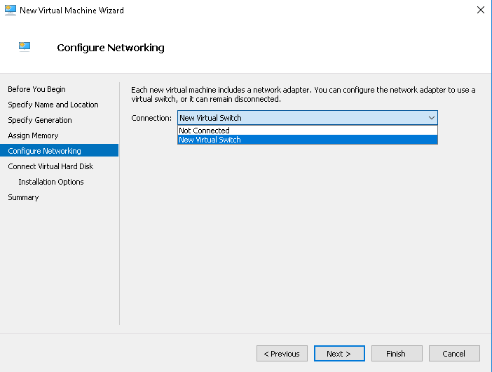
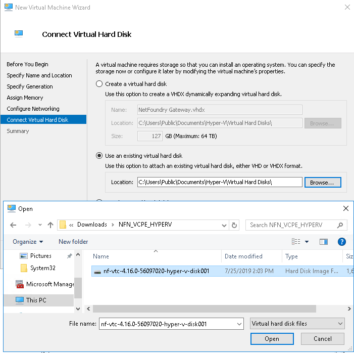

# How to Launch a NetFoundry Gateway on Hyper-V 2016/2019


!!! note "Prerequisites"

    Windows 2016 server already running

    All powershell commands require Administrative Privileges 


## Installing Hyper-V

### Installing Binaries
If not already installed, you'll need to install hyper-v

Issue the following command to install hyper-v *** this will restart your server ***

```Install-WindowsFeature -Name Hyper-V -IncludeManagementTools -Restart```


### Installing a VMSwitch


You'll need to have at least one VMSwitch if you don't already have one.

***Please note***, we are adding an Internal switch for setup with a NAT server.  

Issue the following command to install a new "Internal" VSwitch

```New-VMSwitch -SwitchName "Hyper-VSwitch" -SwitchType Internal```


### Configuring NAT


In order to create a NAT IP Address, you need to associate it with the Hyper-V VMSwtich(Hyper-V Virtual Ethernet Adapter), like the one created above.  To see the current adapters, issue the following command


```Get-NetAdapter```


Use the result to create a new NATIPAddress on the specified Interface


```New-NetIPAddress -IPAddress 192.168.0.1 -PrefixLength 24 -InterfaceIndex 5```

How you can tell hyper-v what to allow through the Net IPAddresss

```New-NetNat -Name MyNATnetwork -InternalIPInterfaceAddressPrefix 192.168.0.0/24```


### Configuring DHCP
Use the following command to install the dhcp feature:

```Install-WindowsFeature -Name 'DHCP' -IncludeManagementTools```


To create a new DHCP Scope:

```Add-DhcpServerv4Scope -Name GuestIPRange -StartRange 192.168.0.10 -EndRange 192.168.0.20 -SubnetMask 255.255.255.0 -State Active```


To adjust the DHCP Scope Options:

```Set-DhcpServerv4OptionValue -ScopeId GuestIPRange -Router 192.168.1.1```


!!! Note "Important"
    If the DHCP MMC snap-in shows an exclamation mark & doesn't show the scope, you might need to add a hosts entry in c:\windows\system32\drivers\etc\hosts
    Example entry:

    192.168.0.1    {name of the server}


# Creating a new Virtual Machine NetFoundry Gateway


Download our Hyper-V image from the download site: [Downloads](https://netfoundry.io/resources/support/downloads/)

Unzip the file to access the VHD file.

Open the Hyper-V Manager




Click on "New" → "Virtual Machine..."


Name the Virtual Machine


Select "Generation 1"


Assign memory to the Virtual Machine


Assign the Virtual Machine to a VMSwitch




Point the downloaded VHD





Finish the Virtual Machine Setup


You can now start the VM


