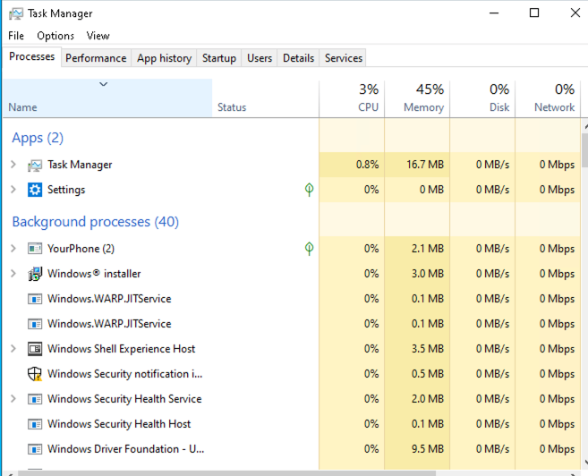
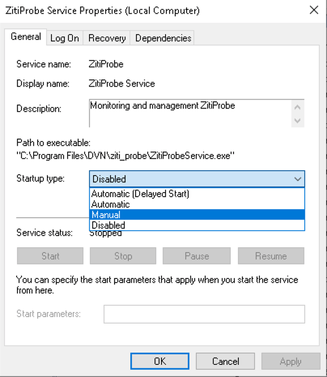
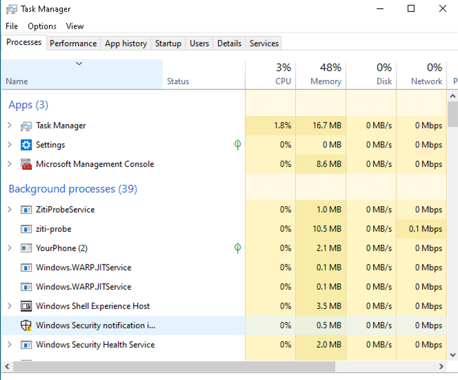

# Overview
Zitiprobe is disabled on the VCPE gateways and Window's machines after registration. When you ready to correct probe data, you can turn it on.  This section will show how to do that.

# Centos 7 (VCPE gateways)
On the Linux, the zitiprobe is started by systemctl service.  You can check the status of the zitiprobe by issuing following command at the command prompt:
``` sh
systemctl status ziti-probe
```
The result should show it is <b>disabled</b>
``` sh
$ systemctl status ziti-probe
● ziti-probe.service - Ziti Probe service
   Loaded: loaded (/usr/lib/systemd/system/ziti-probe.service; disabled; vendor preset: disabled)
   Active: inactive (dead)
```
Issue the following command to start the zitiprobe:
``` sh
sudo systemctl start ziti-probe
```
Issue "status" command, should show the service is now <b>active (running)</b>
``` sh
$ systemctl status ziti-probe
● ziti-probe.service - Ziti Probe service
   Loaded: loaded (/usr/lib/systemd/system/ziti-probe.service; disabled; vendor preset: disabled)
   Active: active (running) since Mon 2020-09-21 13:33:42 CDT; 4s ago
  Process: 1183 ExecStartPre=/bin/test -f /opt/netfoundry/ziti/ziti-probe/PROBENET.json (code=exited, status=0/SUCCESS)
 Main PID: 1185 (ziti-probe) CGroup: /system.slice/ziti-probe.service
           └─1185 /opt/netfoundry/ziti/ziti-probe/ziti-probe run /opt/netfoundry/ziti/ziti-probe/PROBENET.json
```
Once the collection of data is done, you can stop the zitiprobe by issuing this command:
``` sh
sudo systemctl stop ziti-probe
```

# Windows
On Windows machines, the zitiprobe is started by Windows' service. By default, it is not running.  Start the task manager, you will notice there is no "ZitiProbeService" or "ziti-probe" process running.



To Start the zitiprobe for data collection, you can open windows <b>Services</b> App. Scroll to the bottom of the services, and find "ZitiProbe Service".


Open "ZitiProbe Service" and set the "Startup Type" to "Manual"


Then press the "Start" botton.


This will start the zitiprobe.  You can see the "ZitiProbeService" and "ziti-probe" processes running by using task manager


To stop the zitiprobe after data collection, you can go the "ZitiProbe Service" and press the "Stop" button
