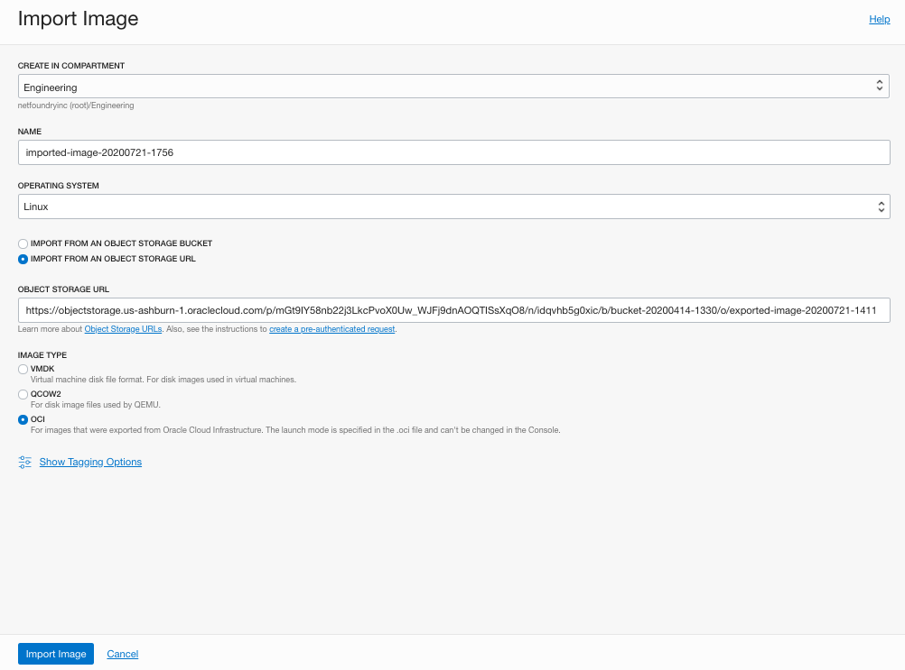

Import Oracle Public Image

# 1 Obtain link to the public image

> https://objectstorage.us-ashburn-1.oraclecloud.com/p/mGt9IY58nb22j3LkcPvoX0Uw_WJFj9dnAOQTISsXqO8/n/idqvhb5g0xic/b/bucket-20200414-1330/o/exported-image-20200721-1411

!!! NOTE
    this link expires on Dec. 31, 2020

# 2 Import this image into your custom images

From the Oracle Cloud menu, navigate to <b>Compute</b> -> <b>Custom Images</b>

Choose <b>Import Image</b>

<li>Choose the compartment you want the image to be in
<li>Choose the name of your image image
<li>In the form, choose <b>IMPORT FROM AN OBJECT STORAGE URL</b>
<li>And fill in <b>OBJECT STORAGE URL</b> from link above  
<li>Choose <b>OCI</b> as Image Type 
</li>

You should see a screen look like this

Press <b>Import Image</b> to continue.  The import process will take few minutes.

# 3 Create Gateway off the image

Once the image is imported, it will appear under your <b>Custom Images</b> page. Click on the image you just import.

You can now click on <b>Create Instance</b> button to create your VM.

# 4 Login to the VM

To login to the VM, you will need to use the accout name "ocp".

You can verify ssh access to the VM by using a ssh enabled terminal:

    > ssh opc@[ip_address_of_the_vm]

Once you are able to login, you can follow the registration process to register this VM to the NetFoundry network.

