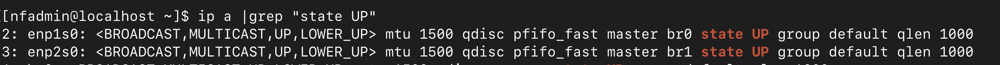
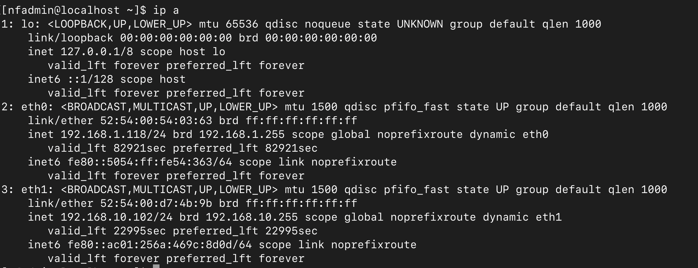

# CPE Automation Supplement

Use this guide to configure the uCPE <b>after</b> running the CPE Automation.<br>
Currently, this guide only include how to configure additional interface.

# 1. Create additional interface using the script

## 1.1 add_additional_bridge.bash

Using shell script to automatically configure the interface is recommended. If you prefer manual steps, you can jump to next section. 

The shell script takes one parameter: “interface_name”. Find out where your additional interface is connected to first.  In my example, it is connected to <b>enp2s0</b>. If your physical interface is already connection, you will be able to find out which interface is connected by using this shell command on the uCPE.
```
ip a |grep “state UP”
```

You should see output like this:



Then issue the command on the uCPE:
```
sudo ./add_additional_bridge.bash enp2s0
```

The script will perform the following:
<li> Search for the next bridge number to configure (If this is first time you run this script, the next bridge inteface is <b>br1</b>)
<li>Configure interface files for both the interface (in this example, <b>enp2s0</b>) and the bridge configuration (<b>br1</b>). These files are placed under <b>/etc/sysconfig/network-scripts</b>
<li>Restart the network, so both bridge interface and physical interface will reset to the new configuration.
<li>Create additional interface on the VM on the bridge just created

Once script finishes, you can go to section “Configure IPs“ to continue configuration

## 1.2 Manually configure VM interface

!!! NOTE
    Skip over this section if you already run the script to setup the bridge and interface

Make sure you know the physical interface name you want to configure your interface on.  If the interface is already physically connected, you can find the interface by issuing: 
```
ip a |grep “state UP”
```

In our example, we use “enp2s0”<br>

Find the bridge interface you want to create on the physical interface. Bridge interface will be used by the VM also.  Since the <b>br0</b> already used by CPE automation to create the first interface on the VM, so in this example we will use <b>br1</b>.

The two files look like this: 
```
ifcfg-enp2s0

DEVICE=enp2s0
ONBOOT=yes
TYPE=Ethernet
NM_CONTROLLED=no
BRIDGE=br1
```
```
ifcfg-br1

DEVICE=br1
TYPE=Bridge
BOOTPROTO=none
ONBOOT=yes
STP=off
NM_CONTROLLED=no
DELAY=0
```
Move both files under <b>/etc/sysconfig/network-scripts</b>

Restart the network:
```
sudo systemctl restart network
```

Attach the bridge to your vm:
```
sudo virsh attach-interface --domain nfgateway --type bridge --source br1 --model virtio --config --live
```

## 1.3 Configure IPs
You should be able to login to the VM to configto ure the IP on the new interface. Please note, the first additional interface created is “<b>eth1</b>”, and the next one will be “<b>eth2</b>” and so on.

When you login to the VM, the interface should look like this:


The interface on the VM will default to be DHCP. If you want to setup a static IP, you can use “<b>nmtui</b>” tool or setup a static interface script file.

