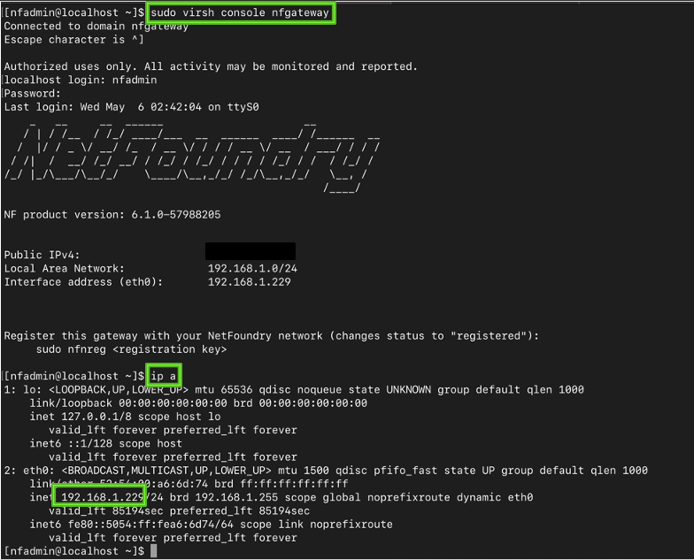
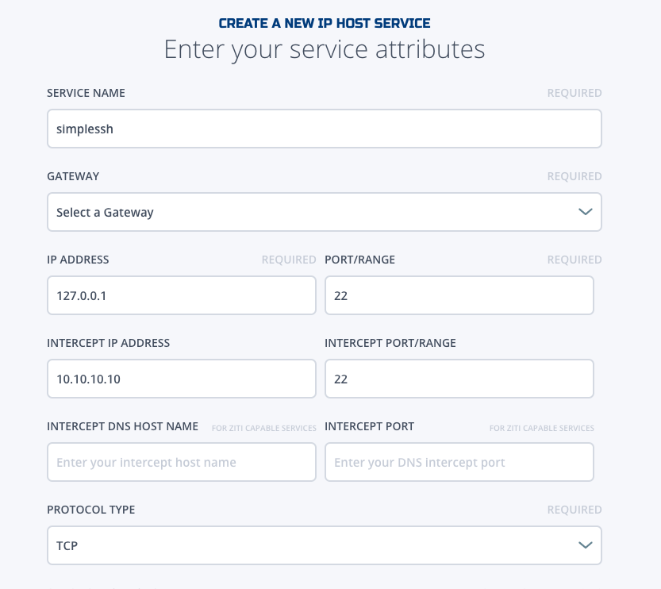

# Partner Program

Use this procedure to setup the uCPE box, register to the NFN network and run traffic testing

# 1. Setup the uCPE box

Please following the "CPE Automation" document to setup the uCPE equipment

# 2. Register Equipment

!!! NOTE
    You will need to sign in to the NetFoundry Console to complete this step, please obtain the organization's login credential.

## 2.1 Obtain the Registration Key

<li> Login to nfconsole.io  
<li> Find the correct Network (Please note, an organization may have more than one network  
<li> Create a VCPE Gateway (If the Gateway was already obtain the registration code), capture the registration code displayed like below: 
</li>

## 2.2 Find the IP address of the NetFoundry Gateway

The NetFoundry Gateway runs as a VM within the uCPE.  If you have the Gateway IP address, skip to the next step

<li> ssh to the uCPE using a ssh terminal</li>

    > ssh nfadmin@[ip_address_of_the_uCPE]

Login to the uCPE by using password: <b>nfadmin</b>

<li> console to the VM</li>

    > sudo virsh console nfgateway

Login to the VM by using: 
login: <b>nfadmin</b> 
password: <b>nfadmin</b> 

<li> find the IP address of the VM</li>

    > ip a

!!! NOTE
    In the example picture below, the IP address of the VM is "192.168.1.229"

<li> You can disconnect from the VM by hitting "<b>ctrl-]</b>". If you need to register this VM, you don't need to disconnect until you finish registration.</li>

##2.3 Registration

You can either register the Gateway VM by staying in the "virsh session" from the step above, or you can ssh into the VM from the IP address obtained above.

    > ssh nfadmin@[ip_address_of_the_gateway_vm]

Login to the vm by using password: <b>nfadmin</b>

<li> register the VM by using the registration key obtained above:</li>

    > sudo nfnreg <registration key>

# 3 Traffic testing

!!! NOTE
    A test server will need to setup to test the traffic. Or we can utilize two uCPEs to test traffic between two machines.

To create a simple test service, head to nfconsole, and crete a IP HOST SERVICE.

Following is a "ssh service"

After the service is create, you can put both service and testing VCPE GW into an AppWAN. Then you can test ssh to "10.10.10.10" from your VCPE GW.

Please refer to console documentation for more details about services  and AppWAN if you have more questions.
